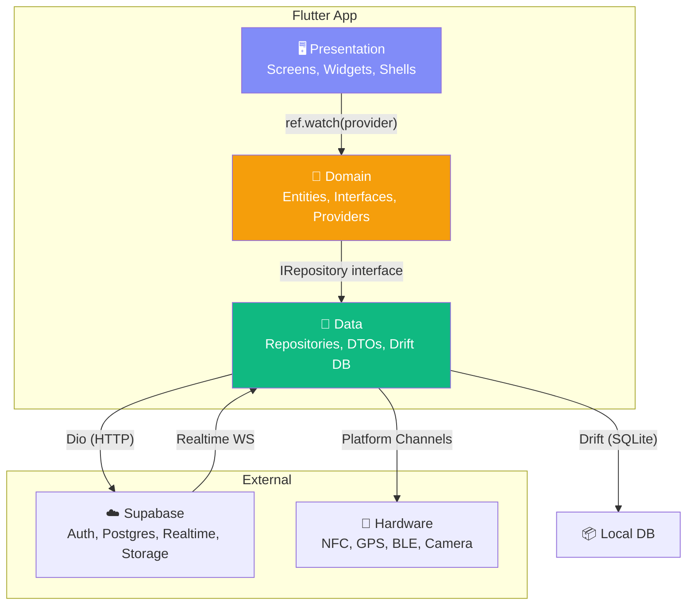
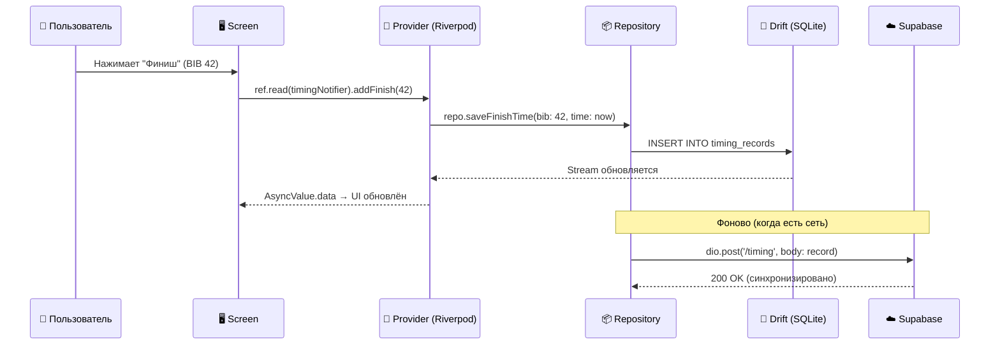
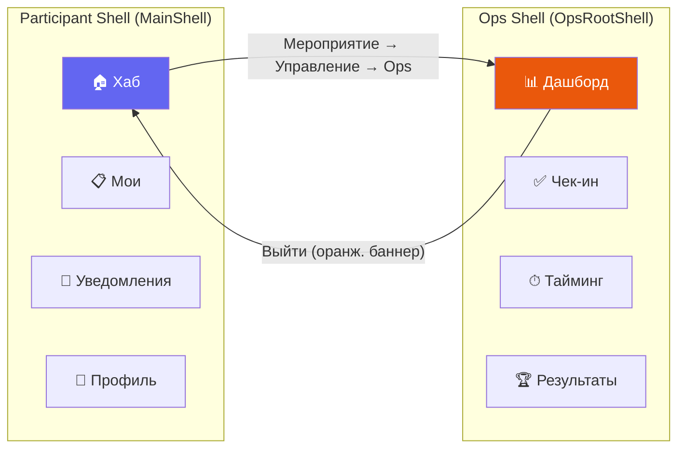
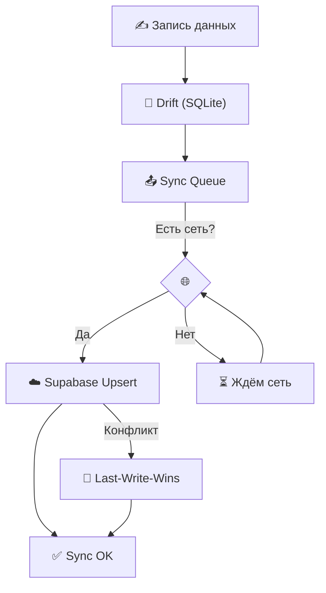

# Архитектура SportOS

Визуальный обзор системы для быстрого понимания.

## Общая диаграмма

## Поток данных: от нажатия до БД

## Двухрежимная навигация

## Offline-first: поток синхронизации

## Слои и их ответственности

| Слой | Что содержит | Знает о | НЕ знает о |
|---|---|---|---|
| **Presentation** | Screen, View, Widget | Domain (providers, entities) | Data (Drift, Dio) |
| **Domain** | Entity, Interface, Provider | Только свои абстракции | Реализация (откуда данные) |
| **Data** | Repository, DTO, Drift Tables | Domain (entity для маппинга) | UI (как отображать) |
| **Core** | Theme, Widgets, Utils | Ничего специфичного | Фичи |
