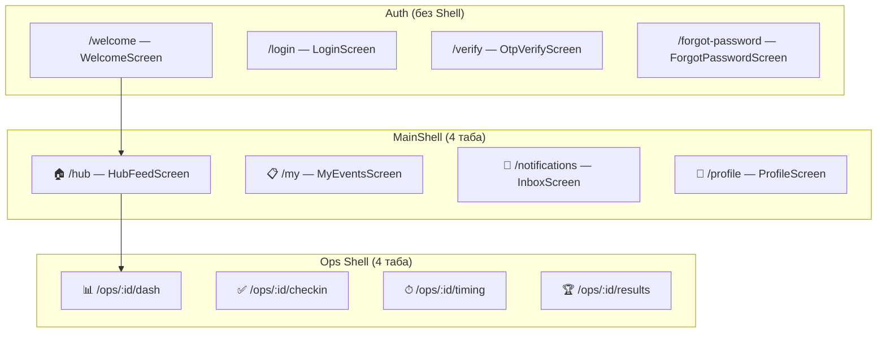

# Карта экранов SportOS

Полный список всех экранов с маршрутами, разбитый по модулям.

## Навигационная структура

## Полный реестр маршрутов

### 🔐 Авторизация (A1 — A4)

| ID | Маршрут | Экран | Файл |
|---|---|---|---|
| A1 | `/welcome` | WelcomeScreen | `auth/welcome_screen.dart` |
| A2 | `/login` | LoginScreen | `auth/login_screen.dart` |
| A3 | `/verify` | OtpVerifyScreen | `auth/otp_verify_screen.dart` |
| A4 | `/forgot-password` | ForgotPasswordScreen | `auth/forgot_password_screen.dart` |

### 🏠 Хаб (MainShell → Таб 1)

| ID | Маршрут | Экран | Файл |
|---|---|---|---|
| H1 | `/hub` | HubFeedScreen | `hub_feed/hub_feed_screen.dart` |
| H2 | `/hub/search` | HubSearchScreen | `hub_feed/hub_search_screen.dart` |
| H3 | `/hub/event/:eventId` | EventDetailScreen | `events/event_detail_screen.dart` |
| H4 | `/hub/event/:eventId/register` | RegisterWizardScreen | `events/register_wizard_screen.dart` |

### 📋 Мои мероприятия (MainShell → Таб 2)

| ID | Маршрут | Экран | Файл |
|---|---|---|---|
| M1 | `/my` | MyEventsScreen | `events/my_events_screen.dart` |
| M2 | `/my/create` | CreateEventWizardScreen | `events/create_event_wizard_screen.dart` |

### 🔔 Уведомления (MainShell → Таб 3)

| ID | Маршрут | Экран | Файл |
|---|---|---|---|
| N1 | `/notifications` | InboxScreen | `notifications/inbox_screen.dart` |

### 👤 Профиль (MainShell → Таб 4)

| ID | Маршрут | Экран | Файл |
|---|---|---|---|
| U1 | `/profile` | ProfileScreen | `profile/profile_screen.dart` |
| U2 | `/profile/documents` | ProfileDocumentsScreen | `profile/profile_documents_screen.dart` |
| U3 | `/profile/dogs` | MyDogsScreen | `profile/my_dogs_screen.dart` |
| U4 | `/profile/dogs/:dogId` | DogDetailScreen | `profile/dog_detail_screen.dart` |
| U5 | `/profile/results` | MyResultsScreen | `profile/my_results_screen.dart` |
| U6 | `/profile/diplomas` | MyDiplomasScreen | `profile/my_diplomas_screen.dart` |
| U7 | `/profile/settings` | SettingsScreen | `profile/settings_screen.dart` |
| U8 | `/profile/clubs` | MyClubsScreen | `clubs/my_clubs_screen.dart` |
| U9 | `/profile/trainer` | TrainerScreen | `profile/trainer_screen.dart` |

### ⚙️ Управление мероприятием (E1 — E7)

| ID | Маршрут | Экран | Файл |
|---|---|---|---|
| E1 | `/manage/:eventId` | EventOverviewScreen | `events/manage/event_overview_screen.dart` |
| E2 | `/manage/:eventId/disciplines` | DisciplinesScreen | `events/manage/disciplines_screen.dart` |
| E3 | `/manage/:eventId/participants` | ParticipantsScreen | `events/manage/participants_screen.dart` |
| E4 | `/manage/:eventId/team` | TeamScreen | `events/manage/team_screen.dart` |
| E5 | `/manage/:eventId/finances` | FinancesScreen | `events/manage/finances_screen.dart` |
| E6 | `/manage/:eventId/documents` | DocumentsScreen | `events/manage/documents_screen.dart` |
| E7 | `/manage/:eventId/settings` | EventSettingsScreen | `events/manage/event_settings_screen.dart` |

### 📋 Подготовка к гонке (P1 — P6)

| ID | Маршрут | Экран | Файл |
|---|---|---|---|
| P1 | `/manage/:eventId/draw` | DrawScreen | `events/prep/draw_screen.dart` |
| P2 | `/manage/:eventId/startlist` | StartListScreen | `events/prep/start_list_screen.dart` |
| P3 | `/manage/:eventId/bibs` | BibAssignScreen | `events/prep/bib_assign_screen.dart` |
| P4 | `/manage/:eventId/vetcheck` | VetCheckScreen | `events/prep/vet_check_screen.dart` |
| P5 | `/manage/:eventId/mandate` | MandateScreen | `events/prep/mandate_screen.dart` |
| P6 | `/manage/:eventId/checkin` | CheckInScreen | `events/prep/check_in_screen.dart` |

### 🏁 Ops Shell — Режим судьи

| ID | Маршрут | Экран | Файл |
|---|---|---|---|
| O1 | `/ops/:eventId/dash` | OpsDashboardScreen | `ops/ops_dashboard_screen.dart` |
| O2 | `/ops/:eventId/checkin` | CheckInScreen *(reuse)* | `events/prep/check_in_screen.dart` |
| O3 | `/ops/:eventId/timing` | OpsTimingHubScreen | `ops/ops_timing_hub_screen.dart` |
| R1 | `/ops/:eventId/timing/starter` | StarterScreen | `ops/starter_screen.dart` |
| R2 | `/ops/:eventId/timing/finish` | FinishScreen | `ops/finish_screen.dart` |
| R3 | `/ops/:eventId/timing/marshal` | MarshalScreen | `ops/marshal_screen.dart` |
| R4 | `/ops/:eventId/timing/dictator` | DictatorScreen | `ops/dictator_screen.dart` |
| R5 | `/ops/:eventId/timing/map` | GpsMapScreen | `ops/gps_map_screen.dart` |
| O4 | `/ops/:eventId/results` | LiveResultsScreen *(reuse)* | `results/live_results_screen.dart` |

### 🏆 Результаты (RS1 — RS4)

| ID | Маршрут | Экран | Файл |
|---|---|---|---|
| RS1 | `/results/:eventId/live` | LiveResultsScreen | `results/live_results_screen.dart` |
| RS2 | `/results/:eventId/protocol` | ProtocolScreen | `results/protocol_screen.dart` |
| RS3 | `/results/:eventId/protests` | ProtestsScreen | `results/protests_screen.dart` |
| RS4 | `/results/:eventId/diplomas` | DiplomaGenScreen | `results/diploma_gen_screen.dart` |

### 🏛 Клубы (C1 — C4)

| ID | Маршрут | Экран | Файл |
|---|---|---|---|
| C1 | `/clubs/create` | CreateClubScreen | `clubs/create_club_screen.dart` |
| C2 | `/clubs/:clubId` | ClubProfileScreen | `clubs/club_profile_screen.dart` |
| C3 | `/clubs/:clubId/manage` | ClubManageScreen | `clubs/club_manage_screen.dart` |

### Другое

| ID | Маршрут | Экран | Файл |
|---|---|---|---|
| QR | `/pair` | QrPairingScreen | `auth/qr_pairing_screen.dart` |
| S1 | `/series/:seriesId` | SeriesScreen | `events/series_screen.dart` |
| MD | `/manage/:eventId/multiday` | MultiDayConfigScreen | `events/manage/multi_day_config_screen.dart` |

---

**Итого: 44 экрана** (2 переиспользуемых: CheckInScreen, LiveResultsScreen)
