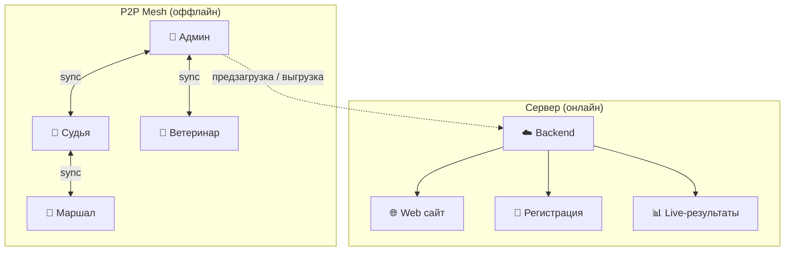
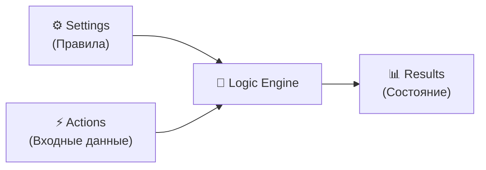
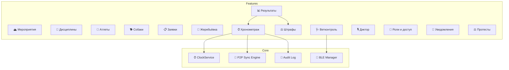

# 01. Обзор системы SportOS

> Профессиональная платформа спортивного хронометража и управления мероприятиями. Offline-first, P2P-синхронизация, специализация на ездовом спорте.

---

## Содержание

1. [Назначение](#1-назначение)
2. [Ключевые архитектурные принципы](#2-ключевые-архитектурные-принципы)
3. [Технологический стек](#3-технологический-стек)
4. [Модули системы](#4-модули-системы)
5. [Поддерживаемые виды спорта](#5-поддерживаемые-виды-спорта)
6. [Связанные документы](#6-связанные-документы)

---

## 1. Назначение

SportOS — универсальная платформа для организации спортивных соревнований с глубокой специализацией под ездовой спорт (*mushing*). Система обеспечивает полный цикл: от создания мероприятия и регистрации участников до высокоточного хронометража и публикации результатов.

### Ключевые задачи

- Проведение соревнований в условиях **полного отсутствия интернета**
- *Хронометраж* с точностью до сотых долей секунды
- Поддержка сложных форматов: масс-старт, раздельный старт, *Гундерсен*, эстафеты
- Управление специфическими сущностями ездового спорта: собаки, вакцинации, упряжки
- Live-трансляция результатов при появлении связи

---

## 2. Ключевые архитектурные принципы

### 2.1 Гибридная архитектура: Сервер + P2P Mesh

Система комбинирует **сервер** (для регистрации, профилей, live-результатов) и **P2P Mesh** (для оффлайн-хронометража).



**Граница онлайн/оффлайн**:
- **До мероприятия**: Сервер = источник правды (регистрация, настройка)
- **День мероприятия**: «Скачать для оффлайн» → данные в локальную БД
- **Во время гонки**: Локально + P2P = источник правды
- **После гонки**: Результаты → сервер → web

> [см. 05-p2p-sync.md](file:///Users/arseniagreseva/Documents/Hronos/docs/05-p2p-sync.md) — детали протокола синхронизации.

---

### 2.2 Высокая точность хронометража

Системные часы мобильных устройств дрейфуют на 1–5 мс/мин. Стратегия компенсации:

1. **GPS PPS / NTP** — калибровка *Clock Offset* перед стартом
2. **Monotonic clock** — использование `CLOCK_BOOTTIME`, устойчивого к перезапуску
3. **Абсолютное время** в каждой записи — гарантия сопоставимости при перезапуске приложения
4. **Периодическая рекалибровка** — каждые 60 секунд

**Формула**:
```
corrected_time = monotonic_clock + clock_offset
```

> [см. 04-timing-engine.md](file:///Users/arseniagreseva/Documents/Hronos/docs/04-timing-engine.md) — детальный дизайн хронометража.

---

### 2.3 Гибкость правил

Система поддерживает:
- Масс-старты, раздельные старты, *Гундерсен* (преследование), эстафеты
- Конфигурируемые *категории* через конструктор измерений (пол, класс, возраст)
- Независимость стартового порядка от протокольной группировки
- Шаблоны мероприятий для быстрого создания

---

### 2.4 Единое приложение для всех ролей

```
«The Admin is just a Role»
```

Одно приложение для всех: администратор, судья, маршал, ветеринар, диктор, зритель. Интерфейс адаптируется к назначенным ролям. Пользователь может переключаться между доступными ролями в реальном времени.

> [см. 07-roles-and-security.md](file:///Users/arseniagreseva/Documents/Hronos/docs/07-roles-and-security.md) — модель ролей.

---

### 2.5 Trinity Model (из существующей документации)

Вычислительная модель системы основана на трёх столпах:



- **Settings (Config)**: Статические правила — тип старта, интервалы, категории, кол-во кругов
- **Actions (Ops)**: Динамические входы — нажатия кнопок, RFID-считывания, назначения штрафов
- **Results (State)**: Вычисляемый результат = `f(Config, Actions)`

> **Золотое правило**: Финальный ранг **никогда** не хранится в БД. Всегда вычисляется на лету.

---

## 3. Технологический стек

| Слой | Технология | Обоснование |
|---|---|---|
| **Framework** | Flutter 3.x | Кроссплатформенность iOS/Android/Web из одной кодовой базы |
| **Language** | Dart 3.x | Нативная поддержка Flutter |
| **State Management** | BLoC / Riverpod | Реактивность, тестируемость, разделение UI и логики |
| **Local DB** | Isar 3.x | Высокая скорость, zero-config, реактивные потоки, Flutter-нативная |
| **DI** | GetIt + Injectable | Инъекция зависимостей |
| **Routing** | GoRouter | Декларативная навигация |
| **P2P Transport** | Nearby Connections / Multipeer | Кроссплатформенный P2P |
| **Serialization** | Protocol Buffers | Компактный бинарный формат для P2P sync |
| **BLE** | flutter_blue_plus | Связь с периферией |
| **GPS** | geolocator | Калибровка часов |
| **NTP** | ntp (package) | Калибровка часов |
| **PDF** | pdf (dart) | Генерация протоколов и дипломов |
| **Cloud (опц.)** | Firebase | Live-результаты при наличии интернета |
| **Web (Live)** | Flutter Web / статический сайт | Публичная трансляция результатов |
| **i18n** | intl / arb | Полная интернационализация, стартовые языки: RU, EN |

---

## 4. Модули системы



| Модуль | Документ | Описание |
|---|---|---|
| Хронометраж | [04-timing-engine.md](file:///Users/arseniagreseva/Documents/Hronos/docs/04-timing-engine.md) | Очередь меток, lifecycle, точность |
| P2P Sync | [05-p2p-sync.md](file:///Users/arseniagreseva/Documents/Hronos/docs/05-p2p-sync.md) | CRDT, конфликты, транспорт |
| Мероприятия | [06-event-lifecycle.md](file:///Users/arseniagreseva/Documents/Hronos/docs/06-event-lifecycle.md) | Полный путь мероприятия |
| Роли | [07-roles-and-security.md](file:///Users/arseniagreseva/Documents/Hronos/docs/07-roles-and-security.md) | Доступ, QR, audit log |
| Экраны | [08-ux-screens.md](file:///Users/arseniagreseva/Documents/Hronos/docs/08-ux-screens.md) | Детали UI/UX |
| Интеграции | [09-integrations.md](file:///Users/arseniagreseva/Documents/Hronos/docs/09-integrations.md) | Чипы, принтеры, облако |
| Навигация | [10-navigation-map.md](file:///Users/arseniagreseva/Documents/Hronos/docs/10-navigation-map.md) | Карта экранов |

---

## 5. Поддерживаемые виды спорта

### Предустановленные (в каталоге)

| Вид спорта | Дисциплины |
|---|---|
| **Ездовой спорт (зима)** | Скиджоринг, Пулка, Нарта-2/4/6/8, Эстафета |
| **Ездовой спорт (лето)** | Каникросс, Скутер, Велосипед, Эстафета |
| **Бег** | Спринт, Средние дистанции, Кросс |
| **Лыжные гонки** | Классика, Коньковый ход, Спринт |
| **Велоспорт** | Шоссе, Кросс-кантри, Трек |

### Пользовательские

Организатор может создать произвольный вид спорта и набор дисциплин.

---

## 6. Связанные документы

- [00-glossary.md](file:///Users/arseniagreseva/Documents/Hronos/docs/00-glossary.md) — Глоссарий терминов
- [02-domain-model.md](file:///Users/arseniagreseva/Documents/Hronos/docs/02-domain-model.md) — Доменная модель
- [03-module-architecture.md](file:///Users/arseniagreseva/Documents/Hronos/docs/03-module-architecture.md) — Модульная архитектура
- [11-decisions-log.md](file:///Users/arseniagreseva/Documents/Hronos/docs/11-decisions-log.md) — Журнал решений
