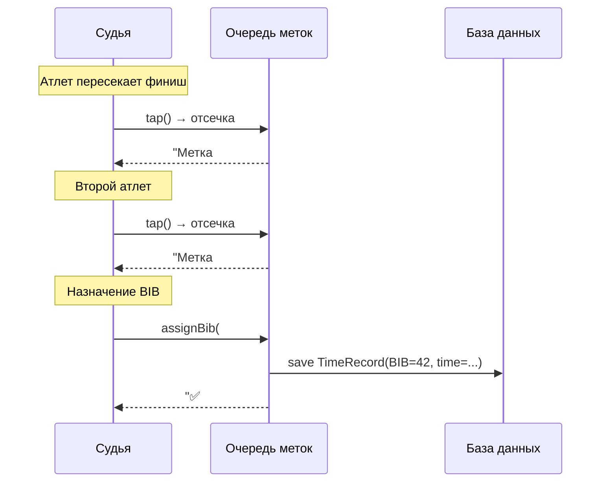
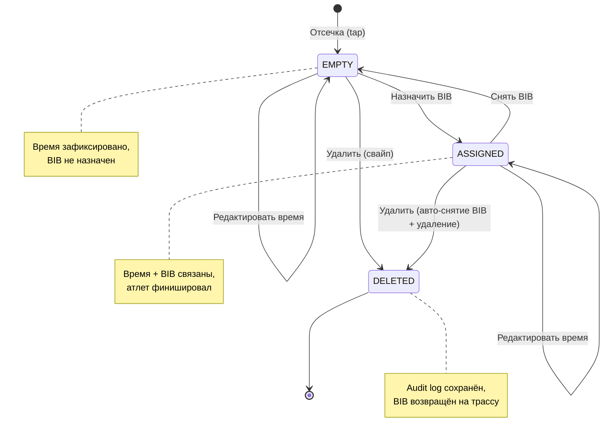
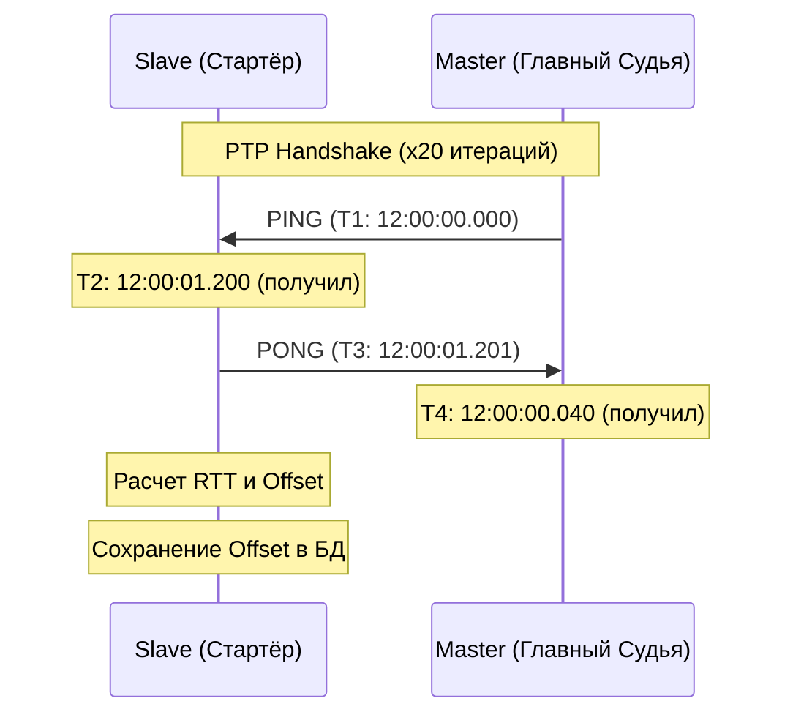
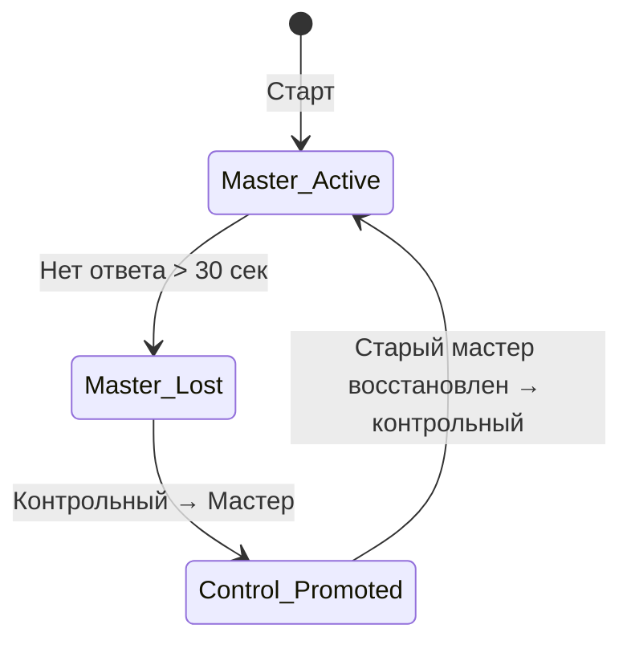

# 04. Хронометраж (Timing Engine)

> Самый критичный модуль системы. Отвечает за фиксацию, хранение и обработку временных отсечек. Ошибка хронометража = невалидные результаты.

---

## Содержание

1. [Контекст и цели](#1-контекст-и-цели)
2. [Архитектурные решения](#2-архитектурные-решения)
3. [Режим «Очередь меток»](#3-режим-очередь-меток)
4. [Жизненный цикл отсечки (TimeMark)](#4-жизненный-цикл-отсечки-timemark)
5. [Синхронизация часов](#5-синхронизация-часов)
6. [Мастер и контрольный таймер](#6-мастер-и-контрольный-таймер)
7. [Многокруговость](#7-многокруговость)
8. [Режимы старта](#8-режимы-старта)
9. [Photo-Finish](#9-photo-finish)
10. [Абстрактный адаптер оборудования](#10-абстрактный-адаптер-оборудования)
11. [Edge Cases и ограничения](#11-edge-cases-и-ограничения)
12. [Связанные документы](#12-связанные-документы)

---

## 1. Контекст и цели

Хронометраж должен работать в двух режимах одновременно или по отдельности:

| Режим | Описание | Источник |
|---|---|---|
| **Ручной** | Судья нажимает кнопку, вручную назначает BIB | Устройство судьи |
| **Автоматический** | Чипы/транспондеры, считыватель на линии | TimingHardwareAdapter |

Система должна обеспечивать:
- Точность до 0.01 секунды
- Работу в полном оффлайне
- Защиту от потери данных (тройная репликация)
- Разрешение конфликтов при нескольких судьях

---

## 2. Архитектурные решения

### ADR-01: Абсолютное время в каждой записи

- **Решение**: каждая *отсечка* хранит абсолютное время (`wall_clock + clock_offset`) а не только монотонное
- **Контекст**: monotonic clock сбрасывается при перезапуске приложения
- **Альтернатива**: хранить только monotonic — проще, но не переживает краш
- **Последствия**: записи сопоставимы даже после перезапуска; требуется дополнительное поле

### ADR-02: Мастер + Контрольный таймер

- **Решение**: одно устройство — *мастер-таймер* (официальное время), второе — *контрольный таймер* (резервное)
- **Контекст**: два судьи на финише оба нажимают отсечку → дубли. Нужен один источник правды
- **Альтернатива**: среднее арифметическое — нестандартно и спорно; ручное утверждение — медленно
- **Последствия**: результат берётся с мастера; контрольный — для кросс-валидации и failover

### ADR-03: Тройная репликация данных

- **Решение**: каждая отсечка мгновенно реплицируется на контрольное устройство + устройство админа + локальный бэкап каждые 30 сек
- **Контекст**: данные хронометража невосстановимы
- **Последствия**: потеря данных только при одновременном выходе из строя 3+ устройств

---

## 3. Режим «Очередь меток»

Основной рабочий процесс судьи на финише.

### Принцип работы

Фиксация времени **отделена** от идентификации BIB. Судья сначала фиксирует моменты пересечения линии, потом назначает номера.



### Доступные операции с очередью

| Операция | Жест | Описание | Audit Log |
|---|---|---|---|
| **Добавить отсечку** | Большая кнопка внизу | Фиксирует текущий corrected_time | Автоматически |
| **Назначить BIB** | Тап на метку → модалка | Привязать BIB к отсечке | Автоматически |
| **Снять BIB** | Long press → «Снять» | BIB возвращается «на трассу», отсечка становится пустой | Автоматически |
| **Сменить BIB** | Long press → «Сменить» | Модалка, выбор нового BIB. Старый возвращается на трассу | + комментарий |
| **Удалить метку** | Свайп влево | Удаляет пустую метку. Для назначенной — сначала автоснятие BIB | + комментарий |
| **Вставить метку** | Long press → «Вставить» | Ручной ввод времени (по видео). Новая метка в хронологическом порядке | + обязательный комментарий |
| **Редактировать время** | Long press → «Редактировать» | Корректировка миллисекунд | + обязательный комментарий |
| **Swap позиций** | Long press → «Переместить» | Перетаскивание метки на другую позицию | + комментарий |

> Все операции с назначенными метками требуют комментарий в *Audit Log*.

---

## 4. Жизненный цикл отсечки (TimeMark)



### Правила перехода

- При **снятии BIB**: атлет возвращается в список «на трассе» (доступен в модалке)
- При **смене BIB**: старый BIB → на трассу, новый BIB → назначен. Одна операция
- При **удалении назначенной**: автоматическое снятие BIB → удаление пустой. Требует подтверждения: «Вы удаляете финиш BIB 42. Подтвердите.»
- Результаты на экране диктора обновляются **в реальном времени** при любом изменении

---

## 5. Офлайн Синхронизация Часов (PTP Handshake)

Так как гонки проводятся в условиях отсутствия сети, доверять системному времени устройств нельзя из-за «временного дрифта» (дешевые Android-устройства могут сдвигаться на 2-5 секунд в час). Синхронизация по времени является **абсолютным блокирующим требованием** перед началом гонки.

### Офлайн P2P-синхронизация (Precision Time Protocol)

Вместо NTP серверов в лесу, устройства синхронизируются друг с другом по протоколу PTP поверх Wi-Fi Direct / BLE. Главное правило: **Мы не меняем системное время на смартфоне програмно, мы вычисляем и сохраняем `Offset`**.

1. **Главный Судья (Master Clock)** открывает QR-код P2P-сети в приложении.
2. **Стартёры и Маршалы (Slave)** сканируют QR-код.
3. Происходит 20 быстрых итераций `PING -> PONG` обмена пакетами.
4. Вычисляется время в пути (RTT) и точное смещение часов (Offset) с точностью до 2-5 миллисекунд:
   `Offset = ((T2 - T1) + (T3 - T4)) / 2`



### Структура ClockOffset

```dart
class ClockOffset {
  final String masterDeviceId;
  final int offsetMs;        // Master time − Local system time
  final String source;       // 'ptp_p2p' | 'gps' | 'ntp'
  final DateTime measuredAt;
}
```

> **Критически важно**: использовать `CLOCK_BOOTTIME` (монотонные часы, устойчивые к sleep), а не `DateTime.now()`. При записи каждой отсечки в БД (Event Sourcing), сохраняется и сырое `system_time`, и вычисленное `master_time` (raw + offset). Это позволяет делать перерасчеты задним числом.

### Disaster Recovery (Локальная Отказоустойчивость)
Мастер нужен **ТОЛЬКО в момент предстартовой синхронизации**.
После рукопожатия (Handshake) каждое Slave-устройство становится автономным и само вычисляет Истинное Время гонки, вычитая `Offset`.
Если устройство Главного судьи сломалось в середине гонки:
1. Берется новый телефон.
2. Включается режим **Reverse Sync**.
3. Телефон подходит к *любому* выжившему в лесу Slave-устройству (например, Стартёру).
4. Проводится PTP Handshake, и новый телефон копирует "Истинный хронометраж гонки" из логов Стартёра, становясь точной копией потерянного Мастера.

---

## 6. Мастер и контрольный таймер

### Назначение ролей

- *Мастер-таймер* — назначается в настройках мероприятия (или автоматически — первое устройство на финише)
- *Контрольный таймер* — второе устройство на финише

### Failover



**Правила**:
1. При потере мастера — контрольное устройство автоматически становится мастером
2. Восстановленное устройство становится контрольным
3. Все отсечки с контрольного во время failover — валидны как мастер-отсечки
4. Факт failover записывается в *Audit Log*

---

## 7. Многокруговость

### Определение текущего круга

```
function resolveCurrentLap(entry_id, race_id):
    completed = db.timeRecords
        .where(entry_id, race_id, type IN [SPLIT, FINISH])
        .count()
    
    current_lap = completed + 1
    max_laps = discipline.lap_count
    
    if current_lap > max_laps:
        return ERROR("Все круги пройдены")
    if current_lap == max_laps:
        record_type = FINISH
    else:
        record_type = SPLIT
    
    return (current_lap, record_type)
```

### Защита от двойного считывания

Параметр `min_lap_time` (настраивается в дисциплине, по умолчанию 20 сек). Если между двумя отсечками одного BIB прошло < `min_lap_time` — вторая отсечка игнорируется с предупреждением.

---

## 8. Режимы старта

### Масс-старт

- Судья/стартёр нажимает кнопку «GUN» → `ZeroTime` для всех атлетов
- **Отмена случайного старта**: подтверждение в течение 5 секунд («Отменить старт?»)
- Повторный запуск: `ZeroTime` обновляется, все вычисления пересчитываются
- `NetTime = FinishTime - ZeroTime`

### Раздельный старт

- `PlannedStartTime = FirstStart + (Position × Interval)`
- Интервалы **настраиваются per-группа** (напр. Group A: 30с, Group B: 45с)
- Буфер между группами настраивается отдельно
- Старт **автоматический по времени** (обратный отсчёт)
- Разница между плановым и фактическим — проблема спортсмена (кроме случаев с чипами)
- `NetTime = FinishTime - PlannedStartTime`

### Принудительный ранний старт

- Судья выбирает атлета в стартовом списке → «Стартовать сейчас» или «Привязать к BIB X»
- Фиксируется **ActualStartTime** (момент нажатия кнопки или момент старта BIB X)
- `NetTime = FinishTime - ActualStartTime`
- Запись в *Audit Log*: причина раннего старта

### Гундерсен (преследование)

- Стартовый интервал = отставание от лидера Day 1
- `StartGap[i] = ResultDay1[i].NetTime - ResultDay1[0].NetTime`
- Лидер стартует в 0, остальные с отставанием
- Первый на финише = победитель
- BIB может сохраняться или пересобираться (настраивается)

### Эстафета

- Команда из N участников, каждый бежит один этап
- Тип передачи (настраивается): «по пересечению линии» / «по касанию»
- Хронометраж: общее время команды + время каждого этапа
- Штраф участника = штраф команды. DSQ участника = DSQ команды
- Требования к составу конфигурируются (напр. минимум 1 CEC в команде)

---

## 9. Photo-Finish

При финише группы атлетов (разница < 1 сек):

### Два механизма разрешения

1. **Два независимых судьи**: мастер и контрольный фиксируют порядок независимо. Система сравнивает. При расхождении — конфликт на экран главного судьи
2. **Видео**: устройство записывает 10-секундный клип при каждой отсечке. Судья просматривает видео для определения порядка

---

## 10. Абстрактный адаптер оборудования

```dart
abstract class TimingHardwareAdapter {
  Stream<HardwareTimeMark> get marks;     // Поток отсечек
  Future<void> connect();
  Future<void> disconnect();
  HardwareStatus get status;
}

class HardwareTimeMark {
  final DateTime timestamp;
  final String? chipId;         // Если чип считан
  final String adapterId;       // Тип оборудования
  final Map<String, dynamic> metadata;
}
```

Конкретные адаптеры для RFID, активных транспондеров и др. подключаются как плагины. Ручной режим — это тоже «адаптер» (ManualTimingAdapter), который генерирует отсечки по нажатию кнопки.

---

## 11. Cutoff Time (лимит прохождения)

- Настройка на уровне дисциплины: `cutoffTime` (напр. 2:00:00)
- При истечении: **автоматический DNF** + уведомление судье
- Судья может **override** (пропустить) с записью в *Audit Log*
- Атлет финишировал на 1 сек позже cutoff: результат стоит, судья решает

---

## 12. Tie-break (равное время)

| Режим | Описание | Пример |
|---|---|---|
| **shared** | Оба делят место | 3 и 3, следующий — 5 |
| **start_order** | Кто раньше стартовал — выше | При tie → ранний BIB выше |

Настройка на уровне мероприятия. Гундерсен при tie в Day 1 — оба стартуют одновременно в Day 2.

---

## 13. Отмена DNS

- Стартёр ошибочно пометил DNS → механизм отмены на экране стартёра и финиша
- После отмены: атлет появляется в плитках финиша
- Запись в *Audit Log*

---

## 14. Edge Cases и ограничения

| Ситуация | Решение |
|---|---|
| Атлет не отображается на финише до старта | Фильтр: `status = started`. До старта — невидим |
| Судья случайно нажал отсечку | Свайп для удаления, без BIB — без последствий |
| 5 атлетов финишировали за 1 сек | Photo-finish: два судьи + видео |
| Приложение крашнулось | Абсолютное время + failover на контрольное устройство |
| Устройство разряжено | Тройная репликация (мастер + контрольный + админ) |
| Перезаезд | Стартовая позиция назначается вручную, не двигает время старта других |
| DNF на 3-м из 4-х кругов | Показать split-times 3 кругов, 4-й — «DNF». Конфигурируемая классификация |
| Min Lap Time нарушен | Отсечка игнорируется с предупреждением |
| Принудительный ранний старт | ActualStartTime = момент нажатия, NetTime от фактического старта |
| Cutoff time превышен | Автоматический DNF + возможность override судьёй |
| Ошибочный DNS | Механизм отмены DNS на экране стартёра |
| Судья не успел тапнуть вовремя | Ручная коррекция времени + обязательный Audit Log |

---

## 15. Связанные документы

- [00-glossary.md](file:///Users/arseniagreseva/Documents/Hronos/docs/00-glossary.md) — определения терминов хронометража
- [05-p2p-sync.md](file:///Users/arseniagreseva/Documents/Hronos/docs/05-p2p-sync.md) — как отсечки синхронизируются между устройствами
- [08-ux-screens.md](file:///Users/arseniagreseva/Documents/Hronos/docs/08-ux-screens.md) — экран финиша (UI-спецификация)
- [06-event-lifecycle.md](file:///Users/arseniagreseva/Documents/Hronos/docs/06-event-lifecycle.md) — когда и как запускается хронометраж
- [12-gap-analysis.md](file:///Users/arseniagreseva/Documents/Hronos/docs/12-gap-analysis.md) — Gap Analysis: GAP-08, GAP-09, GAP-10, GAP-11, GAP-12
