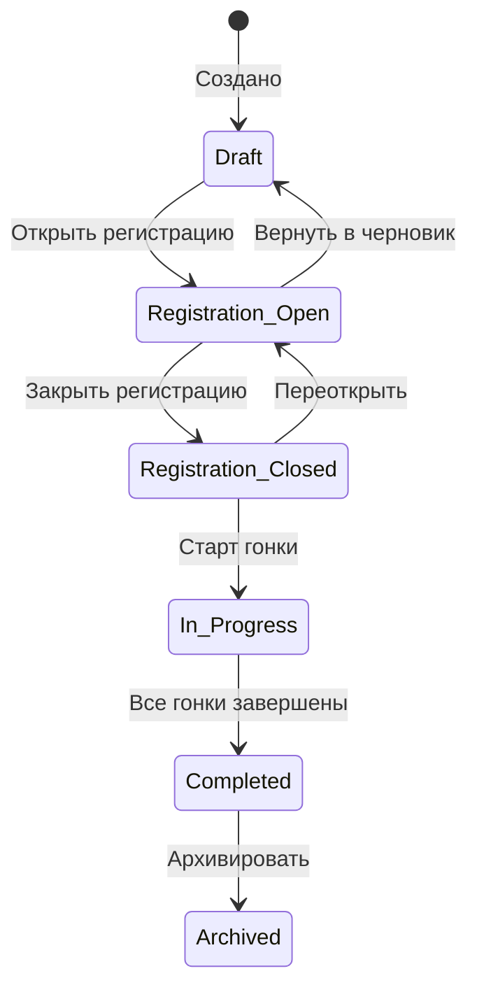
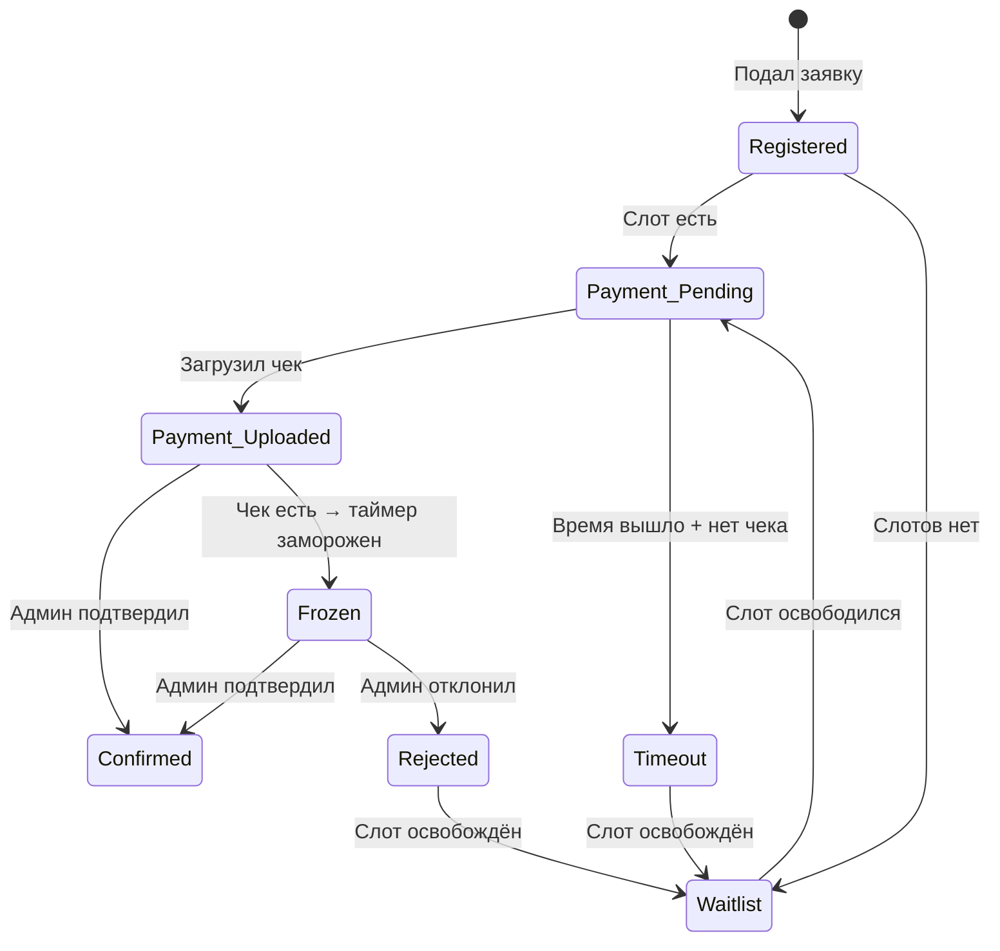
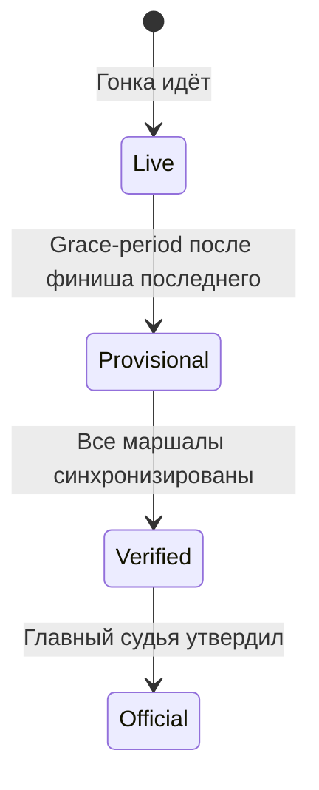
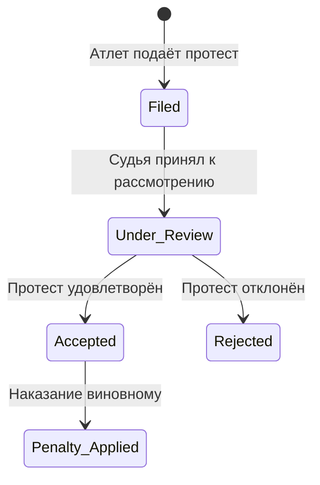

# 06. Жизненный цикл мероприятия

> Полный путь мероприятия от создания до архива. Включает настройку дисциплин, регистрацию, жеребьёвку, проведение и публикацию результатов.

---

## Содержание

1. [Статусы мероприятия](#1-статусы-мероприятия)
2. [Создание мероприятия](#2-создание-мероприятия)
3. [Настройка: трассы и дисциплины](#3-настройка-трассы-и-дисциплины)
4. [Категории и группировка](#4-категории-и-группировка)
5. [Регистрация участников](#5-регистрация-участников)
6. [Оплата и лист ожидания](#6-оплата-и-лист-ожидания)
7. [Жеребьёвка](#7-жеребьёвка)
8. [Проведение гонки](#8-проведение-гонки)
9. [Результаты и протоколы](#9-результаты-и-протоколы)
10. [Многодневные мероприятия](#10-многодневные-мероприятия)
11. [Протесты и апелляции](#11-протесты-и-апелляции)
12. [Бэкап и архивация](#12-бэкап-и-архивация)
13. [Связанные документы](#13-связанные-документы)

---

## 1. Статусы мероприятия



| Статус | Действия участников | Действия организатора |
|---|---|---|
| **Черновик** | Не видят | Настройка, редактирование |
| **Регистрация открыта** | Подача заявок, оплата | Одобрение заявок, настройка |
| **Регистрация закрыта** | Просмотр стартового листа | Жеребьёвка, финальная подготовка |
| **В процессе** | Участие в гонке | Хронометраж, штрафы, управление |
| **Завершено** | Просмотр результатов | Публикация протоколов, дипломы |
| **Архив** | Просмотр истории | Использование как шаблон |

---

## 2. Создание мероприятия

### Минимальное создание

Для создания мероприятия необходимо только:
- **Название**
- **Дата начала**

Все остальные параметры настраиваются позже через вкладки мероприятия.

### Создание из шаблона

1. Выбрать шаблон из списка (прошлые мероприятия / предустановленные)
2. Система копирует: дисциплины, трассы, правила, форму регистрации
3. **Не копируются**: участники, результаты, даты
4. Организатор меняет дату, лого — готово

### Структура карточки мероприятия (6 вкладок)

| Вкладка | Содержание |
|---|---|
| **Обзор** | Название, даты, место, лого, описание, статус |
| **Дисциплины** | Список дисциплин, настройка каждой |
| **Участники** | Заявки, лист ожидания, жеребьёвка |
| **Команда** | Роли, QR-коды, цепочка наследования |
| **Финансы** | Реквизиты, статус оплат, возвраты/переносы |
| **Документы** | Регламент PDF, GPX-треки, шаблон дипломов, настройка протокола |

---

## 3. Настройка: трассы и дисциплины

### Слой 1: Трассы (Courses)

Трассы определяются **на уровне мероприятия**, не дисциплины. Одна трасса может использоваться несколькими дисциплинами.

```
Трассы мероприятия:
├── Малый круг — 1 км (GPX)
├── Средний круг — 4 км (GPX)
└── Большой круг — 8 км (GPX)
```

**Параметры трассы**: название, дистанция (км), GPX-трек (опционально), описание.

### Слой 2: Каталог видов спорта

Организатор выбирает вид спорта → система предлагает каталог дисциплин с дефолтными настройками.

**Предустановленные виды спорта:**

| Вид спорта | Дисциплины |
|---|---|
| Ездовой спорт (зима) | Скиджоринг, Пулка, Нарта-2/4/6/8, Эстафета |
| Ездовой спорт (лето) |Каникросс, Скутер, Велосипед, Эстафета |
| Бег | Спринт, Средние, Кросс |
| Лыжные гонки | Классика, Коньковый ход |
| Велоспорт | Шоссе, Кросс-кантри |

Организатор может **создать пользовательский вид спорта** и свои дисциплины.

### Слой 3: Настройка дисциплины

| Параметр | Описание | Пример |
|---|---|---|
| Название | Название дисциплины | «Скиджоринг 5 км» |
| Вид спорта | Из каталога или пользовательский | Ездовой спорт (зима) |
| Трасса | Ссылка на трассу мероприятия | Малый круг |
| Кол-во кругов | Сколько раз пройти трассу | 5 (= 5 км) |
| Тип старта | mass / individual / pursuit / relay | individual |
| Интервал старта | Секунды между участниками | 30 |
| Время первого старта | Абсолютное время | 10:00:00 |
| Макс. участников | Ограничение слотов | 60 |
| Min Lap Time | Защита от дубля (сек) | 20 |
| Политика DNF Day 2 | strict / penalized / open | penalized |
| Возраст собак мин. | Минимальный возраст допуска | 15 месяцев |
| Разделять по полу в протоколе | Да / Нет | Да |

---

## 4. Категории и группировка

### Конструктор измерений

Организатор выбирает **оси** категоризации:

```
☑️ Пол: [М] [Ж]
☑️ Класс: [CEC] [OPEN]
☐ Возраст: [Юниоры] [Взрослые] [Ветераны] — не используем
```

Система автоматически генерирует комбинации: `М-CEC`, `Ж-CEC`, `М-OPEN`, `Ж-OPEN`.

Организатор может:
- Удалить ненужные комбинации
- Добавить пользовательские оси (напр. «Кол-во собак: 2/4/6»)

### Ключевой принцип: Стартовый порядок ≠ Протокольное разделение

| Настройка | Старт | Протокол |
|---|---|---|
| Совместный старт, раздельный протокол | М и Ж стартуют вместе | Отдельные таблицы М и Ж |
| Совместный старт, совместный протокол | М и Ж стартуют вместе | Одна общая таблица |
| Раздельный старт, раздельный протокол | Сначала М, потом Ж | Отдельные таблицы |

*Стартовые потоки* настраиваются отдельно от *категорий протокола*.

---

## 5. Регистрация участников

### Два канала регистрации

| Канал | Когда | Кто вводит |
|---|---|---|
| **Онлайн** | До мероприятия, при наличии интернета | Спортсмен сам |
| **На месте** | На площадке, оффлайн | Организатор / администратор |

### Конструктор формы регистрации

Организатор настраивает, какие поля обязательны:

**Базовые (всегда):**
- ФИО, дата рождения, пол, контакт (телефон/email)

**Настраиваемые (галочками):**
- Город / клуб
- Номер лицензии федерации
- Медицинская справка (загрузка фото/PDF)
- Чекбокс «Несу ответственность за свою жизнь» (текст редактируемый)
- Страховой полис
- Согласие родителей (для несовершеннолетних)

**Пользовательские поля:**
Организатор может добавить своё поле: `название + тип (текст / число / файл / чекбокс)`

### Для ездового спорта — дополнительно:

- Выбор дисциплины
- Добавление собак: кличка, чип-номер, фото, дата вакцинации
- Валидация: уникальность чипа в рамках мероприятия (при дубликате — предупреждение)

---

## 6. Оплата и лист ожидания

### Модель оплаты — «внешняя»

Система **не проводит платежи**. Она:
1. Отображает реквизиты организатора (карта, QR банка, ссылка)
2. Атлет оплачивает вне системы и загружает фото чека
3. Администратор вручную подтверждает оплату

### Лист ожидания

Если все слоты заняты — атлет попадает в *лист ожидания*.



**Ключевое правило**: загрузка чека **замораживает таймаут**. Атлет сделал свою часть — наказывать за задержку админа несправедливо.

### Перенос оплаты

При отмене мероприятия или снятии атлета:
- Возврат средств — за рамками системы (организатор разбирается сам)
- Система отслеживает статус: `к возврату` / `к переносу на следующее мероприятие`
- Перенос: оплата привязывается к следующему мероприятию, атлет не платит повторно

---

## 7. Жеребьёвка

### Настройки

| Параметр | Опции |
|---|---|
| **Режим** | Автоматическая / Ручная расстановка / Комбинированная |
| **Посев** | Случайный / Ручной seed (ранг → позиция) / По истории (будущее) |
| **Группировка** | Общая (М и Ж вместе) / Раздельная (по категориям) |
| **Порядок групп** | Настраивается (напр. сначала CEC, потом OPEN) |
| **Буфер между группами** | Минуты (напр. 5 мин пауза) |

### Результат жеребьёвки

- Каждому атлету назначается:
  - **BIB** (стартовый номер)
  - **Стартовая позиция** (может отличаться от BIB)
  - **Время старта** (вычисляется из позиции + интервала)

- Организатор может **скорректировать вручную** после автоматической жеребьёвки
- После утверждения → **стартовый лист опубликован**

### BIB между днями (многодневные)

| Вариант | Описание |
|---|---|
| **Сохранить** | Те же номера, новый стартовый порядок |
| **Новая жеребьёвка** | Новые номера, новый порядок |
| **Гундерсен** | Те же номера, порядок по отставанию от лидера Day 1 |

---

## 8. Проведение гонки

### Предстартовый чек-лист (конфигурируемый)

Организатор определяет обязательные проверки:
- ☑️ Оплата подтверждена
- ☑️ Ветконтроль пройден (если включён)
- ☑️ Документы проверены (если требуются)
- ☑️ Снаряжение проверено

Пока все галочки не стоят — предупреждение стартёру.

### Рабочие экраны (Ops)

Подробное описание каждого экрана — [см. 08-ux-screens.md](file:///Users/arseniagreseva/Documents/Hronos/docs/08-ux-screens.md).

Хронометраж — [см. 04-timing-engine.md](file:///Users/arseniagreseva/Documents/Hronos/docs/04-timing-engine.md).

### Штрафы

| Тип | Значение | Назначение |
|---|---|---|
| **Временной штраф** | +15 сек, +60 сек и т.д. | На трассе (маршал) или после финиша (судья) |
| **DSQ** | Дисквалификация | Серьёзное нарушение |
| **DNF** | Сход | Двухэтапное подтверждение: маршал → судья |
| **DNS** | Не стартовал | Автоматически (не явился) или вручную |
| **Предупреждение** | Без влияния на время | Фиксация в протоколе |

Библиотека штрафов — предустановленная + пользовательские.

### Перезаезд

- Админ/судья аннулирует результат и назначает новое время старта
- Перезаезд **не двигает время старта других участников** — использует буфер между группами
- При перезаезде в Day 1 — пересчёт интервалов Day 2 автоматически

---

## 9. Результаты и протоколы

### Три стадии результатов



| Стадия | Условие перехода | Можно менять? |
|---|---|---|
| **Live** | Гонка в процессе | Да, автоматически |
| **Provisional** | Grace-period (настраивается, напр. 15 мин) | Да (штрафы, корректировки) |
| **Verified** | Все устройства синхронизированы | Только через протест |
| **Official** | Главный судья подтвердил | Только через федерацию |

### Конфигурируемые колонки протокола

Организатор включает/выключает:
- Split-times по кругам
- Средняя скорость (км/ч, мин/км)
- Клички собак
- Отрыв от лидера / от предыдущего
- Клуб / город

### Формат экспорта
- **PDF** — для печати и публикации
- **Excel/CSV** — для федерации, статистика
- **Web** — live-трансляция через `sportos.live/event-slug`

### Вычисляемые метрики (Trinity Model)

```
NetTime = FinishTime - StartTime
GrossTime = NetTime + PenaltySeconds
Gap_to_Leader = MyNetTime - LeaderNetTime
Gap_to_Prev = MyNetTime - PrevRankNetTime
Speed_kmh = DistanceKM / (NetTime / 3600)
Pace_min_km = (NetTime / 60) / DistanceKM
```

### Авто-флаги подозрительных результатов

| Флаг | Условие |
|---|---|
| ⚡ Too Fast | Скорость > конфигурируемого лимита |
| 🐢 Too Slow | Время > Cutoff |
| ❓ Missed Checkpoint | Есть Checkpoint B, но нет А |

---

## 10. Многодневные мероприятия

### Суммирование этапов

```
TotalTime = Σ NetTime[day_i] для всех дней
```

Итоговый протокол показывает:
- Время каждого дня отдельно
- Суммарное время
- Среднюю скорость по каждому дню и общую
- Ранг по каждому дню и итоговый

### Допуск к Day 2 (конфигурируемый)

| Режим | DNS Day 1 | DNF Day 1 | DSQ Day 1 |
|---|---|---|---|
| **strict** | Не допущен | Не допущен | Не допущен |
| **penalized** | Не допущен | Стартует последним (+макс. время) | Не допущен |
| **open** | Допущен (фикс. интервал) | Допущен (фикс. интервал) | Не допущен |

Администратор может **override** любое решение с записью в *Audit Log*.

---

## 11. Протесты и апелляции

### Workflow



### Параметры

- **Тайм-лимит на подачу** — конфигурируется (напр. 30 мин после финиша)
- **Форма подачи**: текст в приложении **или** фото письменного протеста
- **Вердикт**: текст решения + наказание (штраф, DSQ, предупреждение)
- Вся цепочка хранится в базе и *Audit Log*

---

## 12. Бэкап и архивация

### Три уровня бэкапа

| Уровень | Триггер | Хранилище |
|---|---|---|
| **Локальный автосохранение** | Каждый час | Файловая система устройства админа |
| **Облачный автобэкап** | При появлении интернета | Firebase / облако |
| **Ручной экспорт** | Кнопка «Экспорт» | ZIP-файл (JSON + фото) |

### Импорт

Полный snapshot мероприятия может быть **импортирован** на новое устройство для восстановления.

### Шаблоны

Любое мероприятие может быть **сохранено как шаблон**: копируются настройки (дисциплины, трассы, форма регистрации, правила), без участников и результатов.

---

## 13. Связанные документы

- [04-timing-engine.md](file:///Users/arseniagreseva/Documents/Hronos/docs/04-timing-engine.md) — детали хронометража
- [07-roles-and-security.md](file:///Users/arseniagreseva/Documents/Hronos/docs/07-roles-and-security.md) — назначение ролей команды
- [08-ux-screens.md](file:///Users/arseniagreseva/Documents/Hronos/docs/08-ux-screens.md) — экраны и UX
- [05-p2p-sync.md](file:///Users/arseniagreseva/Documents/Hronos/docs/05-p2p-sync.md) — синхронизация данных
- [10-navigation-map.md](file:///Users/arseniagreseva/Documents/Hronos/docs/10-navigation-map.md) — карта навигации
