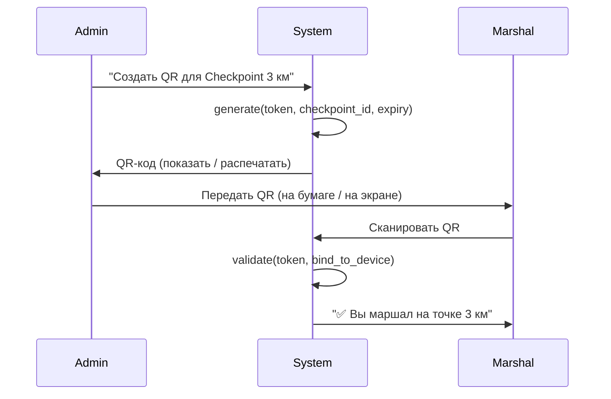
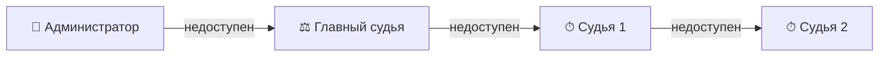

# 07. Роли и безопасность

> Модель управления доступом, назначение ролей, QR-авторизация маршалов, audit log.

---

## Содержание

1. [Модель ролей](#1-модель-ролей)
2. [Динамическое переключение ролей](#2-динамическое-переключение-ролей)
3. [Назначение ролей](#3-назначение-ролей)
4. [QR-авторизация маршалов](#4-qr-авторизация-маршалов)
5. [PIN и защита от brute-force](#5-pin-и-защита-от-brute-force)
6. [Цепочка наследования авторитета](#6-цепочка-наследования-авторитета)
7. [Криптографический Audit Log (Blockchain-подобная защита)](#7-криптографический-audit-log-blockchain-подобная-защита)
8. [Глобальная Криптография и Zero Trust](#8-глобальная-криптография-и-zero-trust)
9. [Связанные документы](#9-связанные-документы)

---

## 1. Модель ролей

Роли назначаются **на уровне мероприятия**, не дисциплины.

| Роль | Символ | Доступ |
|---|---|---|
| **Администратор** | 👑 | Полный доступ: все настройки, жеребьёвка, финансы |
| **Главный судья** | ⚖️ | Утверждение результатов, разрешение конфликтов, штрафы |
| **Судья** | ⏱ | Хронометраж (финиш/старт), штрафы, DNF |
| **Стартёр** | 🟢 | Экран старта, обратный отсчёт, DNS. Может переключиться на финиш |
| **Маршал** | 🚩 | Отметка прохождения checkpoint, фиксация нарушений, запрос DNF |
| **Ветеринар** | 🩺 | Допуск собак, проверка вакцинаций |
| **Диктор** | 🎙 | Просмотр live-результатов, карточки спортсменов, прогнозы |
| **Зритель** | 👀 | Read-only: стартовый лист, результаты |

### Матрица доступа

| Действие | 👑 | ⚖️ | ⏱ | 🟢 | 🚩 | 🩺 | 🎙 | 👀 |
|---|---|---|---|---|---|---|---|---|
| Настройка мероприятия | ✅ | ❌ | ❌ | ❌ | ❌ | ❌ | ❌ | ❌ |
| Жеребьёвка | ✅ | ✅ | ❌ | ❌ | ❌ | ❌ | ❌ | ❌ |
| Утверждение результатов | ✅ | ✅ | ❌ | ❌ | ❌ | ❌ | ❌ | ❌ |
| Назначение штрафов | ✅ | ✅ | ✅ | ❌ | ⚠️ | ❌ | ❌ | ❌ |
| Отсечка / финиш | ✅ | ✅ | ✅ | ❌ | ❌ | ❌ | ❌ | ❌ |
| Управление стартом | ✅ | ✅ | ✅ | ✅ | ❌ | ❌ | ❌ | ❌ |
| Чекпоинт отметка | ✅ | ✅ | ❌ | ❌ | ✅ | ❌ | ❌ | ❌ |
| Ветконтроль | ✅ | ❌ | ❌ | ❌ | ❌ | ✅ | ❌ | ❌ |
| Просмотр live | ✅ | ✅ | ✅ | ✅ | ✅ | ✅ | ✅ | ✅ |

> ⚠️ Маршал может **запросить** DNF/штраф, но окончательное решение — за судьёй.

---

## 2. Динамическое переключение ролей

Пользователю назначаются роли → доступные режимы появляются в меню:

```
┌─ Мои режимы ──────────┐
│ ✅ Финиш (активен)     │
│ ○  Старт               │
│ ○  Диктор              │
└────────────────────────┘
```

**Правила**:
- Переключение **мгновенное** (один тап)
- Активные данные (отсечки, отметки) **не теряются** при переключении
- Администратор может назначать/изменять роли **во время мероприятия** через вкладку «Команда»
- Стартёр после отправки всех атлетов может перейти на финиш

---

## 3. Назначение ролей

### Способы добавления в команду

| Способ | Для кого | Безопасность |
|---|---|---|
| **По имени + PIN** | Судьи, стартёры, ветеринар | Устройство привязано, PIN для входа |
| **QR-код** | Маршалы-волонтёры | Одноразовый, с привязкой к устройству |
| **Самостоятельная регистрация** | Зрители | Без подтверждения, read-only |

---

## 4. QR-авторизация маршалов

### Безопасность QR-кода

| Свойство | Значение |
|---|---|
| **Динамичность (TOTP)** | QR-код на экране Хаба перерисовывается каждую секунду (как Google Authenticator), исключая перехват фотокамерой издалека. |
| **Одноразовость** | Содержит одноразовый якорь для ECDH (Диффи-Хеллман). Фотография QR-кода недееспособна через 2 секунды. |
| **Подтверждение Секретарем** | При сканировании Хаб выдает prompt: "Иван-Маршал пытается подключиться к сети. Разрешить? [Да/Нет]". |
| **Привязка ключей** | Сканирование ассоциирует Public Key устройства судьи с его ролью в Mesh-сети. |

### Генерация



---

## 5. PIN и защита от brute-force

| Параметр | Значение |
|---|---|
| **Формат** | 4-6 цифр |
| **Задержка при ошибке** | Экспоненциальная: 1с → 2с → 4с → 8с... |
| **Блокировка** | После 10 неудачных попыток — блокировка на 30 мин |
| **Reset** | Через QR от администратора |

---

## 6. Цепочка наследования авторитета

Если устройство администратора выходит из строя:



**Правила**:
1. Авторитет привязан к **роли**, не устройству
2. Failover автоматический через 60 секунд недоступности
3. При восстановлении — старший в цепочке возвращает авторитет
4. Все переходы авторитета логируются в *Audit Log*

---

## 7. Криптографический Audit Log (Blockchain-подобная защита)

Разработкой предусмотрена защита от умышленной подделки данных (например, если кто-то получил физический доступ к локальной БД телефона SQLite/Isar и попытался изменить отсечки через редактор БД, либо попытался выдать себя за другого судью).

### Асимметричное шифрование (Ключи Автора):
1. При первой установке приложения SportOS, на устройстве генерируется уникальная пара ключей: **Private Key** (хранится в Secure Enclave / Keystore ОС) и **Public Key**.
2. При подключении судьи к Хабу (сканирование QR-кода), его Public Key регистрируется в Базе Данных Хаба и Облаке, связываясь с его ФИО и Ролью.
3. *Каждая* создаваемая отсечка или запись в БД подписывается локальным Private Key судьи. 
4. Никто (даже Главный Секретарь) не может подделать авторство отсечки, так как не владеет Private Key маршала.

### Что логируется (Audit Log)

Все критичные операции:
- Создание / редактирование / удаление отсечек (TimeRecords)
- Назначение / снятие / смена BIB
- Штрафы, DSQ, DNF
- Смена ролей, failover авторитета
- Утверждение результатов (Official)

### Формат записи (Хэш-цепочка)

Каждая запись не только подписывается ключом, но и математически связывается с предыдущей записью в устройстве.

```dart
class AuditEntry {
  String id;              // UUID
  String deviceId;        // Кто (ID устройства)
  String publicKey;       // Публичный ключ автора
  DateTime timestamp;     // Истинное Время
  String action;          // Что (enum: TIME_MARK_CREATED, BIB_ASSIGNED...)
  Map<String, dynamic> data; // Payload: состояние ДО и ПОСЛЕ
  
  String signature;       // Ed25519/RSA Подпись Payload + PrevHash приватным ключом
  String hash;            // SHA-256(prev_hash + data + signature)
}
```

### Разрешение конфликтов и Проверка подлинности (Blockchain-фича):

```
hash[0] = SHA-256(data[0])
hash[n] = SHA-256(hash[n-1] + data[n] + signature[n])
```

**Защита от локальной подмены (Tamper-Proof)**: 
Если злоумышленник подключит телефон к компьютеру и через DB Browser изменит отсечку в локальной БД (например, поменяет время лидеру), изменятся исходные данные `data[n]`. Из-за этого изменится `hash[n]`, что лавинообразно сломает все последующие хэши `hash[n+1]`, `hash[n+2]`. 
Когда этот телефон попытается слить искаженные данные на Desktop Hub или в Облако, сервер за миллисекунду проверит Public Key и целостность хэш-цепочки. Заметив разрыв цепи или несовпадение подписи, Хаб мгновенно отклонит (Reject) этот пакет данных и выдаст Security Alert Главному Судье с указанием конкретного скомпрометированного устройства.

### Репликация

Audit Log реплицируется на **все устройства** в mesh. Каждое устройство хранит полную копию.

---

## 8. Глобальная Криптография и Zero Trust

Для максимальной защиты системы от внешних (и внутренних) злоумышленников внедрены следующие криптографические протоколы:

### 8.1 Сетевой Транспорт (mTLS)
- **Уязвимость:** Перехват трафика отсечек из Wi-Fi эфира программы-сниффером (Replay-атаки).
- **Решение:** Между мобильным приложением Маршала и Ноутбуком (Хабом) поднимается зашифрованный туннель Mutual TLS (`wss://`). Весь эфирный трафик зашифрован. Каждый пакет имеет одноразовый `nonce` таймстемп, делая повторную отправку перехваченного пакета невозможной.

### 8.2 Защита от клонирования чипов (Anti-NFC Spoofing)
- **Уязвимость:** Клонирование стандартной NFC-метки участника (например, прибором Flipper Zero) на старте и касание финиша копией-смартфоном.
- **Решение:** Использование смарт-чипов стандарта **NTAG 424 DNA** (Secure Unique NFC Message / SUN MAC). Каждое физическое касание меткой смартфона генерирует совершенно новый, одноразовый криптографический хэш. Физическое клонирование сигнала не позволяет злоумышленнику сгенерировать правильный следующий токен.

### 8.3 Цифровая подпись протоколов (Signed Exports)
- **Уязвимость:** Подделка результатов в Excel/PDF перед отправкой Главному Судье Федерации для присвоения спортивных разрядов.
- **Решение:** При выгрузке Протокола (PDF/CSV) из Desktop Hub, приложение вычисляет SHA-256 хэш файла и подписывает его **Приватным Ключом Мероприятия**. Спортивная Федерация загружает полученный файл на Verify-сайт SportOS. Система валидирует файл и гарантирует, что ни одна цифра в ячейках Excel не была скомпрометирована вручную.

---

## 9. Связанные документы

- [05-p2p-sync.md](file:///Users/arseniagreseva/Documents/Hronos/docs/05-p2p-sync.md) — синхронизация audit log между устройствами
- [06-event-lifecycle.md](file:///Users/arseniagreseva/Documents/Hronos/docs/06-event-lifecycle.md) — назначение команды
- [08-ux-screens.md](file:///Users/arseniagreseva/Documents/Hronos/docs/08-ux-screens.md) — экраны ролей
