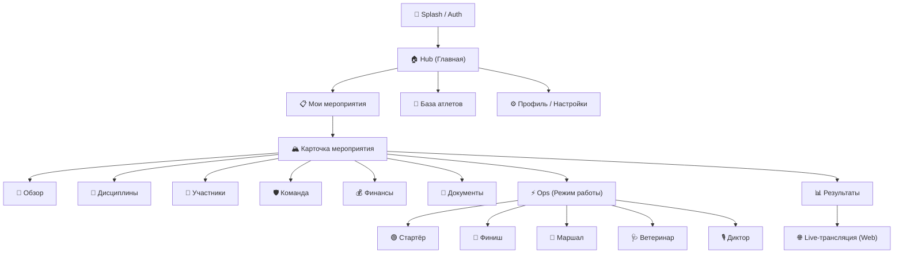
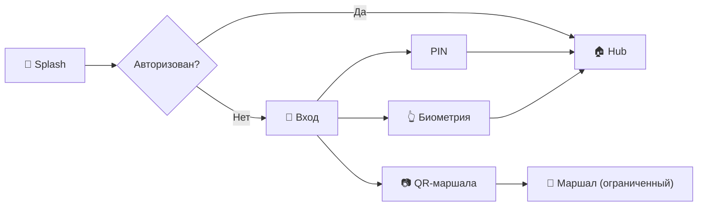
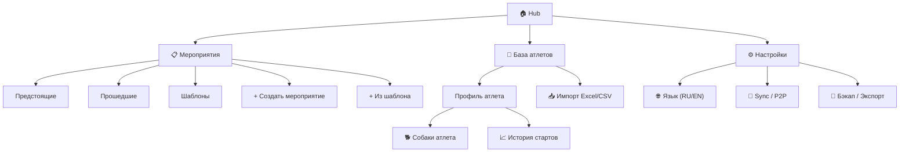
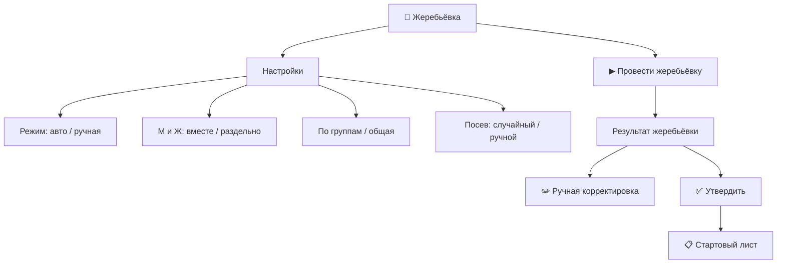
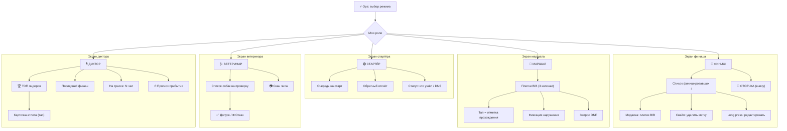
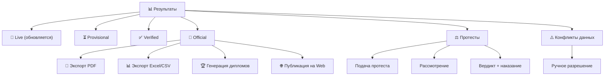
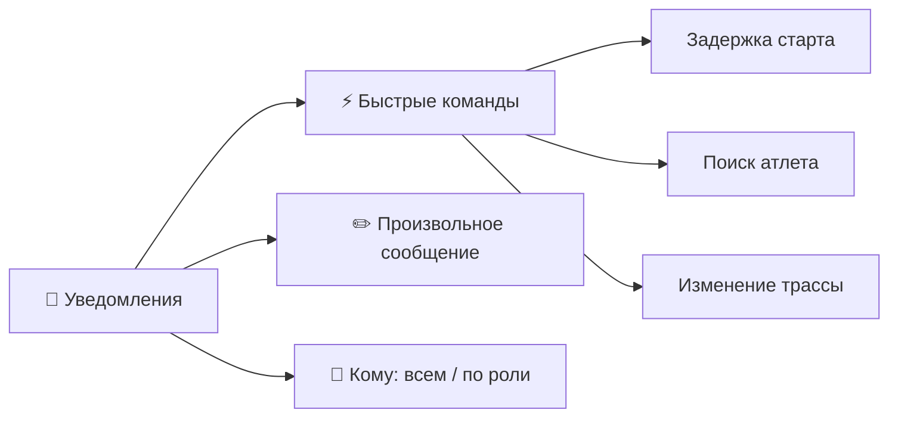
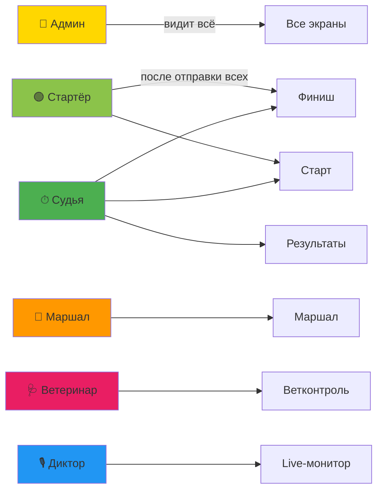

# SportOS: Карта экранов приложения

## 1. Общая структура (High-Level)

---

## 2. Детальная карта по разделам

### 2.1 Авторизация и вход

---

### 2.2 Hub (Главная)

---

### 2.3 Карточка мероприятия (6 вкладок)

```mermaid
graph TD
    EVENT["🏔 Карточка мероприятия"]
    
    subgraph "Вкладка: Обзор"
        OV_INFO["Название, даты, место, лого"]
        OV_STATUS["Статус: Черновик → ... → Архив"]
        OV_STATS["Статистика: участники, слоты, оплаты"]
    end
    
    subgraph "Вкладка: Дисциплины"
        DISC_LIST["Список дисциплин"]
        DISC_LIST --> DISC_DETAIL["Настройка дисциплины"]
        DISC_DETAIL --> DISC_TRACK["Трасса (круг × кол-во)"]
        DISC_DETAIL --> DISC_START_TYPE["Тип старта"]
        DISC_DETAIL --> DISC_CATEGORIES["Категории (конструктор)"]
        DISC_DETAIL --> DISC_RULES["Правила (DNF, min lap time)"]
        DISC_LIST --> ADD_DISC["+ Добавить из каталога"]
    end
    
    subgraph "Вкладка: Участники"
        PART_LIST["Список заявок"]
        PART_LIST --> ENTRY_DETAIL["Заявка атлета"]
        ENTRY_DETAIL --> ENTRY_DOGS["Собаки в заявке"]
        ENTRY_DETAIL --> ENTRY_PAYMENT["Статус оплаты"]
        ENTRY_DETAIL --> ENTRY_CHECKLIST["Предстартовый чек-лист"]
        PART_LIST --> ADD_MANUAL["+ Добавить вручную"]
        PART_LIST --> WAITLIST["📋 Лист ожидания"]
        PART_LIST --> DRAW["🎲 Жеребьёвка"]
    end
    
    subgraph "Вкладка: Команда"
        TEAM_LIST["Список ролей"]
        TEAM_LIST --> ADD_ROLE["+ Добавить (PIN)"]
        TEAM_LIST --> GEN_QR["📱 QR для маршала"]
        TEAM_LIST --> SUCCESSION["⛓ Цепочка наследования"]
    end
    
    subgraph "Вкладка: Финансы"
        FIN_REQS["Реквизиты для оплаты"]
        FIN_STATUS["Статус оплат (оплач/не оплач)"]
        FIN_REFUNDS["К возврату / к переносу"]
    end
    
    subgraph "Вкладка: Документы"
        DOC_REG["📄 Регламент (PDF)"]
        DOC_GPX["🗺 Треки трасс (GPX)"]
        DOC_DIPLOMA["🏆 Шаблон диплома"]
        DOC_PROTOCOL["📊 Настройка протокола"]
    end

    EVENT --> OV_INFO
    EVENT --> DISC_LIST
    EVENT --> PART_LIST
    EVENT --> TEAM_LIST
    EVENT --> FIN_REQS
    EVENT --> DOC_REG
```

---

### 2.4 Жеребьёвка

---

### 2.5 Ops — Рабочие экраны (переключаемые роли)

---

### 2.6 Результаты и протоколы

---

### 2.7 Уведомления и сообщения (P2P)

---

## 3. Переходы между ролями

