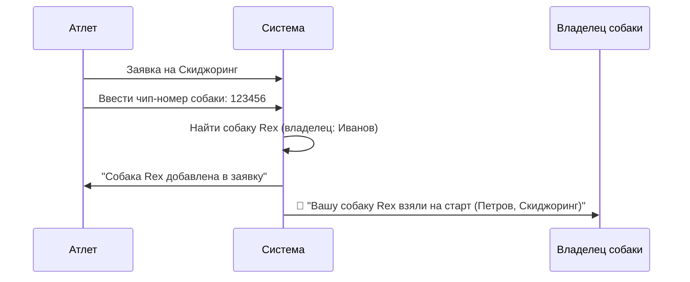
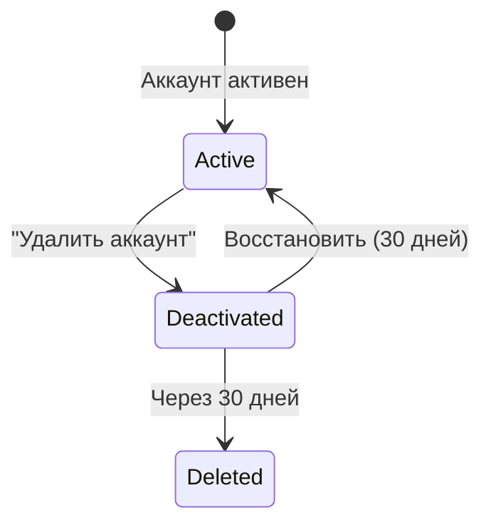

# 13. Профиль пользователя и собаки

> Единый профиль для всех ролей. Собака — самостоятельная сущность с историей и владельцем.

---

## Содержание

1. [Профиль пользователя](#1-профиль-пользователя)
2. [Профиль собаки](#2-профиль-собаки)
3. [Связь атлет ↔ собака](#3-связь-атлет--собака)
4. [Выбор собаки перед стартом](#4-выбор-собаки-перед-стартом)
5. [Уведомления](#5-уведомления)
6. [Приватность](#6-приватность)
7. [Удаление аккаунта](#7-удаление-аккаунта)
8. [Рейтинг атлетов](#8-рейтинг-атлетов)
9. [Связанные документы](#9-связанные-документы)

---

## 1. Профиль пользователя

Один человек = один профиль. Роли назначаются per-мероприятие.

### Структура

```
👤 Профиль
├── 📋 Основное (самозаполнение):
│   ├── ФИО, дата рождения, пол, фото
│   ├── Телефон, email
│   ├── Город, клуб
│   └── Экстренный контакт (опц., приватно)
│
├── 🏅 Виды спорта (самозаполнение):
│   ├── Ездовой спорт — КМС │ Тренер: Петров А.А.
│   ├── Лыжные гонки — 1 разряд │ Тренер: Легков А.
│   └── (разряд + тренер per-вид спорта)
│
├── 🎓 Мои воспитанники (если ты тренер):
│   ├── Сидоров Б. (ездовой спорт) — 8 стартов, 2 🥇
│   ├── Козлова В. (ездовой спорт) — 5 стартов
│   └── (автоматически: атлеты указавшие тебя тренером)
│
├── 📋 Квалификации (самозаполнение):
│   ├── Судья 1 категории (ездовой спорт)
│   ├── Ветеринар
│   └── (не верифицируется системой — история подтверждает)
│
├── 🐕 Мои собаки:
│   ├── Rex — я хозяин
│   └── Luna — я хозяин
│
├── 📊 История (автоматически, не редактируемо):
│   ├── Как атлет: стартов, дисциплины, места
│   ├── Как судья: список мероприятий
│   └── Как ветеринар: список мероприятий
│
└── 🔔 Уведомления
```

### Создание аккаунта

| Способ | Описание |
|---|---|
| **Самостоятельно** | Атлет создаёт аккаунт, заполняет данные |
| **Гостевой** | Организатор регистрирует вручную → «гостевой» профиль без пароля |
| **Забрать гостевой** | Атлет позже привязывает гостевой профиль к своему аккаунту |

### Верификация квалификаций

Система **не верифицирует** квалификации. Вместо этого:
- История автоматически показывает: «был судьёй на 4 мероприятиях»
- Организатор сам решает, доверять ли заявленной категории
- *В будущем*: возможен значок верификации (как в Telegram) для именитых, но механизм требует отдельной проработки

---

## 2. Профиль собаки

Собака — **самостоятельная сущность** с собственным профилем и историей.

### Структура

| Поле | Видимость | Описание |
|---|---|---|
| Кличка | Публично | Имя собаки |
| Порода | Публично | Порода |
| Дата рождения | Публично | Для проверки возраста допуска |
| Фото | Публично | Фото собаки |
| Чип-номер | 🔒 Организаторы | Электронный идентификатор |
| Вакцинации | 🔒 Организаторы | Даты, типы вакцин |
| Владелец | Публично | ФИО хозяина |
| История стартов | Публично | С кем бегала, дисциплины, результаты |

### История выступлений собаки

```
🐕 Rex (Сибирский хаски, 2020 г.р.)
├── С Ивановым А. — Скиджоринг:
│   ├── Чемпионат Урала 2026 — 2 место
│   └── Кубок Сибири 2025 — 5 место
└── С Петровым Б. — Каникросс:
    └── Марафон Урала 2025 — 1 место
Всего стартов: 8 │ Подиумов: 3
```

### Управление данными

- **Владелец** (хозяин) управляет профилем собаки: вакцинации, фото, данные
- Владелец **сам заполняет** даты прививок — проверка на мероприятии ветеринаром
- При смене владельца — передача профиля

---

## 3. Связь атлет ↔ собака

### Регистрация на мероприятие



**Правила**:
- Спортсмен вводит **чип-номер** → система находит собаку
- Согласие владельца в приложении **не требуется**
- Владелец получает **уведомление** (информирование)
- Можно добавить **несколько собак** в заявку (основная + запасные)
- Уникальность чипа: одна собака не может бежать в одной дисциплине с двумя спортсменами одновременно

---

## 4. Выбор собаки перед стартом

### Сценарий

Атлет заявил 3 собак. Перед стартом должен выбрать, с кем побежит.

### Кто делает выбор

1. **Атлет** — в приложении до старта
2. **Судья** — спрашивает атлета и ставит выбор в системе

### Индикатор на экране стартёра

```
Стартовый лист:
  ✅ BIB 07 Петров — Rex          ← собака выбрана
  ⚠️ BIB 12 Сидоров — ?           ← НЕ ВЫБРАЛ
  ✅ BIB 24 Иванов — Luna, Storm  ← упряжка выбрана
```

**Правила**:
- `⚠️` — индикатор, **не блокирует старт**
- Судья видит и может спросить
- Если старт без выбора — в протоколе поле «собака» пустое, результат **валиден**

---

## 5. Уведомления

| Уведомление | Триггер | Кому |
|---|---|---|
| ⚠️ Вакцинация истекает | 30 дней до даты | Владельцу собаки |
| 🐕 Вашу собаку взяли на старт | Спортсмен добавил собаку в заявку | Владельцу |
| 📩 Приглашение на мероприятие | Организатор пригласил | Пользователю |
| 🏆 Результат гонки | Результаты стали Official | Атлету |
| 📊 Отчёт мероприятия | Мероприятие завершено | Организатору |

---

## 6. Приватность

| Данные | Публично | Организатор | Владелец |
|---|---|---|---|
| ФИО, город, клуб | ✅ | ✅ | ✅ |
| Телефон, email | ❌ | ✅ | ✅ |
| Экстренный контакт | ❌ | ✅ | ✅ |
| Кличка, порода собаки | ✅ | ✅ | ✅ |
| Чип-номер | ❌ | ✅ | ✅ |
| Вакцинации | ❌ | ✅ | ✅ |
| История стартов | ✅ | ✅ | ✅ |
| Разряды, квалификации | ✅ | ✅ | ✅ |

---

## 7. Удаление аккаунта

### Soft-delete с grace period



| Стадия | Профиль | Протоколы | Собаки |
|---|---|---|---|
| **Deactivated** | Скрыт | «Участник #42» | Оставлены для передачи |
| **Deleted** | Удалён | «---» (анонимизировано) | Удалены (если не переданы) |

---

## 8. Рейтинг атлетов

*Требует отдельной проработки.*

Предварительные критерии (per-дисциплина):

| Критерий | Вес | Описание |
|---|---|---|
| Количество стартов | 20% | Активность |
| Процент подиумов | 30% | Качество |
| Средняя позиция | 25% | Стабильность |
| Уровень соревнований | 25% | Региональные / федеральные |

---

## 9. Связанные документы

- [06-event-lifecycle.md](file:///Users/arseniagreseva/Documents/Hronos/docs/06-event-lifecycle.md) — регистрация и заявки
- [07-roles-and-security.md](file:///Users/arseniagreseva/Documents/Hronos/docs/07-roles-and-security.md) — роли и доступ
- [08-ux-screens.md](file:///Users/arseniagreseva/Documents/Hronos/docs/08-ux-screens.md) — экран ветеринара
- [12-gap-analysis.md](file:///Users/arseniagreseva/Documents/Hronos/docs/12-gap-analysis.md) — GAP-16, GAP-17
