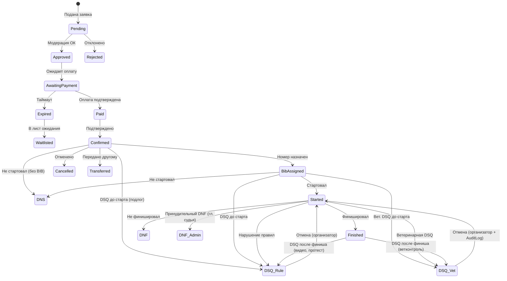
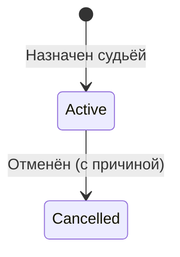
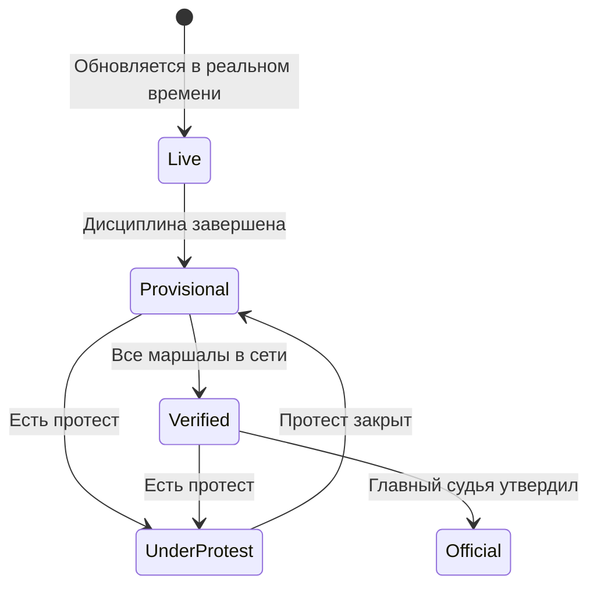
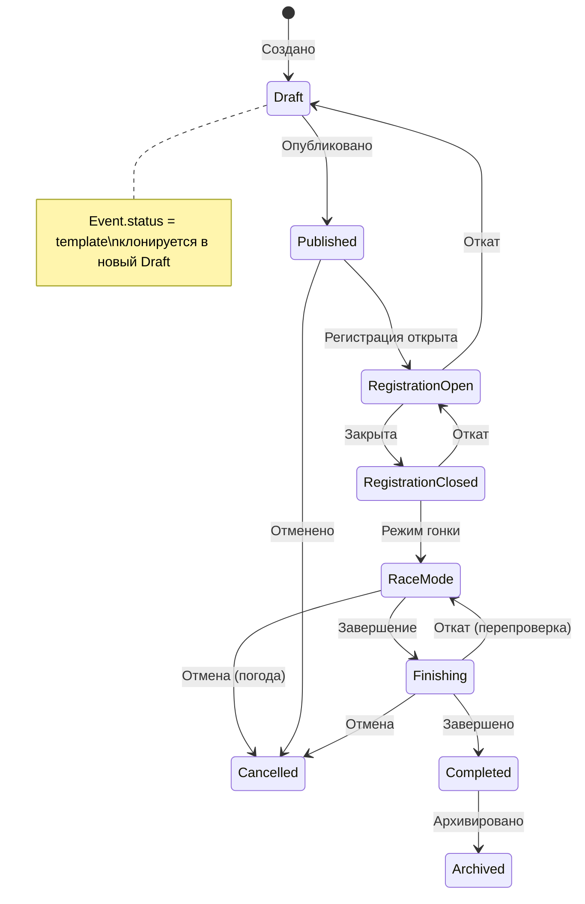
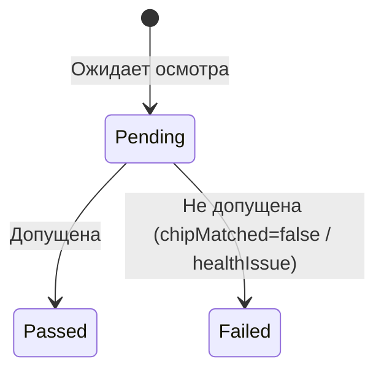

# 15. Domain Model — Сущности и связи

> Полная модель данных SportOS. 40+ сущностей, все связи.
> Обновлено на основе 25 экранов (18-screen-wireframes.md).

---

## ER-диаграмма (основные сущности)

```mermaid
erDiagram
    User ||--o{ Dog : "владеет"
    User ||--o{ UserDocument : "документы"
    User ||--o{ TrainerRelation : "тренер"
    User ||--o{ EventRoleMember : "назначен"
    User ||--o{ Entry : "подаёт заявку"
    User ||--o{ Qualification : "имеет квалификацию"
    User ||--o{ SportRank : "имеет разряд"
    User ||--o{ Notification : "получает"
    User ||--o{ AthleteSubscription : "подписка"
    User ||--o{ OrgMember : "член организации"

    Organization ||--o{ OrgMember : "участники"
    Organization ||--o{ Event : "мероприятия"

    Dog ||--o{ DogVaccination : "прививки"
    Dog ||--o{ DogEventStatus : "статус на мероприятии"

    Event ||--o{ Discipline : "содержит"
    Event ||--o{ EventRole : "роли"
    Event ||--o{ EventDay : "дни"
    Event ||--o{ BibPool : "пул номеров"
    Event ||--o{ PromoCode : "промокоды"
    Event ||--o{ ViolationType : "реестр нарушений"
    Event ||--o{ AuditLog : "аудит"
    Event }|--o| Series : "этап серии"
    Event ||--o| PricingConfig : "ценообразование"
    Event ||--o| MultiDayConfig : "многодневность"
    Event ||--o| TransferConfig : "настройки передачи"
    Event ||--o| ProtestConfig : "настройки протестов"

    EventRole ||--o{ EventRoleMember : "участники"
    EventRole ||--o{ Permission : "права"

    Discipline ||--o{ Category : "категории"
    Discipline ||--o{ Entry : "заявки"
    Discipline ||--o{ StartList : "стартовый лист"
    Discipline ||--o{ StartWave : "волны старта"
    Discipline ||--o{ Checkpoint : "чекпоинты"
    Discipline ||--o{ Result : "результаты"

    Entry ||--|| User : "атлет"
    Entry ||--|| Discipline : "дисциплина"
    Entry }|--o| Dog : "собака"
    Entry }|--o| Payment : "оплата"
    Entry }|--o| BibAssignment : "номер"
    Entry ||--o{ VetCheck : "ветконтроль"
    Entry ||--o{ TimeMark : "отсечки"
    Entry ||--o{ Penalty : "штрафы"
    Entry }|--o| Result : "результат"
    Entry }|--o| TransferRequest : "передача слота"

    Payment ||--o{ PaymentLineItem : "строки"

    Checkpoint }|--o| EventRoleMember : "назначенный маршал"

    Protest }|--|| Entry : "заявитель"
    Protest }|--|| Entry : "обвиняемый"

    TimeMark }|--|| Entry : "атлет"
    TimeMark }|--o| Checkpoint : "точка"

    Penalty }|--|| ViolationType : "тип нарушения"

    Series ||--o{ SeriesPackage : "пакеты"
    Series ||--o{ SeriesStanding : "рейтинг"

    Event ||--o{ DiplomaTemplate : "шаблоны дипломов"
    DiplomaTemplate ||--o{ GeneratedDiploma : "дипломы"

    GuestAccess }|--|| Event : "мероприятие"
    GuestAccess }|--|| Checkpoint : "точка"
```

---

## Полный список сущностей

### Ядро: Пользователи

| Сущность | Описание | Ключевые поля |
|---|---|---|
| **User** | Профиль пользователя | id, name, email, passwordHash?, phone, telegram, telegramId?, photo, birthDate, gender, city, club, emergencyContact, authMethod (telegram / email), status (active / deactivated / deleted), deactivatedAt?, allowSubscriptions (default: true), preferredBib?, mergedFromGhostIds[]? |
| **UserDocument** | Документ атлета | id, userId→User, type (medClearance / insurance), expiryDate, fileUrl, uploadedAt |
| **Dog** | Профиль собаки | id, ownerId→User, name, breed, dob, gender, chipNumber, photo |
| **DogVaccination** | Вакцинации собаки | id, dogId→Dog, type (rabies / complex / other), date, expiryDate, document |
| **DogEventStatus** | Статус собаки на мероприятии | id, dogId→Dog, eventId→Event, status (active / blocked), reason?, blockedBy→User?, unblockedBy→User?, unblockedAt? |
| **SportRank** | Спортивный разряд | id, userId→User, sportTypeId, rank, dateAchieved |
| **Qualification** | Квалификация (судья, вет) | id, userId→User, type, category, validUntil |
| **TrainerRelation** | Связь тренер ↔ ученик | id, trainerId→User, pupilId→User, sportTypeId |
| **SportType** | Вид спорта | id, name, defaultSettings |

> **DogEventStatus:** если ветеринар ставит `VetCheck.status = Failed` → автоматически `DogEventStatus = blocked` по всем дисциплинам. Организатор может разблокировать (записывается в AuditLog).

---

### Ядро: Организации

| Сущность | Описание | Ключевые поля |
|---|---|---|
| **Organization** | Организация / клуб / федерация | id, name, logoUrl, description, contactEmail, contactPhone |
| **OrgMember** | Участник организации | id, orgId→Organization, userId→User, role (owner / admin / member), joinedAt |

> **Права владения:** может быть несколько `owner` в организации. Если один owner удалил аккаунт — остальные продолжают. Мероприятие не теряется никогда.
>
> **Для одиночных организаторов:** при регистрации автоматически создаётся «Личная организация» (1 человек = owner). Можно потом добавить со-организаторов.

---

### Ядро: Мероприятие

| Сущность | Описание | Ключевые поля |
|---|---|---|
| **Event** | Мероприятие | id, orgId→Organization, title, description, location, coordinates, contactInfo, logoUrl, coverUrl, status, seriesId?, startDate, endDate |
| **EventDay** | День мероприятия | id, eventId→Event, dayNumber, date |
| **EventRole** | Роль (шаблон прав) | id, eventId→Event, name, isBuiltin, permissions[] |
| **EventRoleMember** | Назначение роли | id, eventRoleId→EventRole, userId→User, checkpointId?, acceptedAt |
| **Permission** | Атомарное право | id, eventRoleId→EventRole, group, action |
| **GuestAccess** | PIN‑доступ (гостевой) | id, eventId→Event, checkpointId→Checkpoint, pinHash (6+ цифр), token (JWT), role, expiresAt, failedAttempts, lockedUntil? |
| **Discipline** | Дисциплина | id, eventId→Event, sportTypeId, name, distance, startType (individual / mass / wave), interval, cutoffTime, laps, maxParticipants, dogRestMinutes?, minDogAgeMonths?, maxPursuitGapSeconds?, tieBreakMode (shared / start_order)? |
| **Category** | Категория | id, disciplineId→Discipline, name, gender, ageMin, ageMax, autoAssign |
| **Checkpoint** | Контрольная точка | id, disciplineId→Discipline, name, order |

> **Checkpoint.name** — вводится вручную: «3 км», «Отсечка 1», «Поворот у реки».
>
> **Discipline.dogRestMinutes** — минимальный отдых собаки перед следующей дисциплиной (опционально, настраивается организатором). Если указан → система автоматически предупреждает при конфликте расписания собаки.

---

### Ядро: Регистрация и заявки

| Сущность | Описание | Ключевые поля |
|---|---|---|
| **Entry** | Заявка (регистрация) | id, userId→User, disciplineId→Discipline, categoryId, dogId?, status, dsqType?, isOutOfCompetition |
| **Payment** | Оплата | id, entryIds[], amount, method, status, receiptPhoto?, confirmedBy?, paidAt, timeoutAt, promoCodeId? |
| **BibPool** | Пул номеров | id, eventId→Event, rangeStart, rangeEnd, perDiscipline |
| **BibAssignment** | Назначение BIB | id, entryId→Entry, bibNumber (string), isProvisional, assignedAt, confirmedAt? |
| **Draw** | Жеребьёвка | id, disciplineId→Discipline, entryId→Entry, startPosition, drawnAt |
| **StartList** | Стартовый лист | id, disciplineId→Discipline, eventDayId, published |
| **StartListEntry** | Позиция в стартовом листе | id, startListId, startWaveId?, entryId→Entry, plannedStartTime, actualStartTime?, order |
| **StartWave** | Волна старта | id, disciplineId→Discipline, name, categoryIds[], plannedStartTime, buffer |
| **PromoCode** | Промокод | id, eventId→Event, code, discountType (percent / fixed), discountValue, maxUses, usedCount, validUntil |
| **Waitlist** | Лист ожидания | id, disciplineId→Discipline, entryId→Entry, position, addedAt |
| **TransferRequest** | Передача слота | id, fromEntryId→Entry, toUserId→User, toDogId→Dog?, status (pending / approved / rejected), vetCheckRequired, approvedBy→User?, createdAt |
| **TransferConfig** | Настройки передачи | id, eventId→Event, enabled (boolean), deadlineHours (default 48), maxTransfersPerEntry (default 1), pricePolicy (original / free / custom), customFee?, requiresApproval (default true) |

---

### Ядро: Ценообразование

| Сущность | Описание | Ключевые поля |
|---|---|---|
| **PricingConfig** | Конфигурация цен | id, eventId→Event, model (free / flat / perDiscipline), flatPrice?, earlyBirdEnabled, earlyBirdDeadline, earlyBirdType (percent / fixed), earlyBirdValue, earlyBirdScope (all / selected), bookingTimeout |
| **DisciplinePrice** | Цена за дисциплину | id, pricingConfigId, disciplineId→Discipline, price |
| **PaymentRequisites** | Реквизиты оплаты | id, eventId→Event, cardNumber, recipientName, bankName |
| **PaymentLineItem** | Строка платежа | id, paymentId→Payment, entryId→Entry, amount, discount |

> **Правило скидок:** промокоды НЕ суммируются — применяется лучшая скидка. Частичный возврат вычисляется по PaymentLineItem.

---

### Ядро: Хронометраж

| Сущность | Описание | Ключевые поля |
|---|---|---|
| **TimeMark** | Отсечка | id, entryId→Entry, checkpointId?, lapNumber?, rawTime, correctedTime?, correctionReason?, type (start / checkpoint / finish), source (tap / scanner / manual), deviceId, createdBy→User |
| **Penalty** | Штраф | id, entryId→Entry, violationTypeId→ViolationType, timeSeconds?, reason, status (active / cancelled), assignedBy→User, assignedAt, cancelledBy→User?, cancelledAt?, cancelReason? |
| **ViolationType** | Тип нарушения (реестр) | id, eventId→Event, code (V01, V02…), name, defaultPenaltySeconds, severity, isBuiltin |
| **Result** | Результат | id, entryId→Entry, disciplineId, grossTime, netTime, penaltyTime, avgSpeed, position, status (live / provisional / provisional_pending_dog / verified / underProtest / official) |
| **DaySummary** | Результат за день | id, entryId→Entry, eventDayId, dayNetTime, dayPenaltyTime, dayPosition |
| **TotalResult** | Итог (многодневный) | id, entryId→Entry, totalTime, totalAvgSpeed, finalPosition |

---

### Ядро: Протесты и проверки

| Сущность | Описание | Ключевые поля |
|---|---|---|
| **Protest** | Протест | id, filedByEntryId→Entry, againstEntryId→Entry?, penaltyId→Penalty?, category (penalty / result / procedure), reason, evidence?, deadline, status (filed / reviewing / accepted / rejected), verdict?, reviewedBy→User?, reviewedAt? |
| **ProtestConfig** | Настройки протестов | id, eventId→Event, gracePeriodMinutes (default 30), interDayProtestWindowMinutes? |
| **VetCheck** | Ветконтроль | id, entryId→Entry, dogId→Dog, mode (preRace / postRace), checkedBy→User, chipScanned?, chipExpected?, chipMatched?, healthChecklist (JSON), dogOk, notes, status (passed / failed / pending), checkedAt |
| **MandatoryCheck** | Мандатная комиссия | id, entryId→Entry, documentsOk, checkedBy→User, checkedAt, notes |

> **VetCheck** — две записи на заявку: до старта (осмотр + чип) и после финиша (только чип). `chipMatched = false` → нарушение → DSQ.

---

### Ядро: Многодневность

| Сущность | Описание | Ключевые поля |
|---|---|---|
| **MultiDayConfig** | Настройки многодневности | id, eventId→Event, totalDays, day2StartOrder (reverse / same / newDraw), resultAggregation (sum / best / average), dnfPolicy (excludeFromTotal / keepPartial), vetCheckDay2Required |

---

### Ядро: Команды

| Сущность | Описание | Ключевые поля |
|---|---|---|
| **RelayTeam** | Команда эстафеты | id, disciplineId→Discipline, name, status |
| **RelayLeg** | Этап эстафеты | id, relayTeamId, entryId→Entry, legNumber, legTime |
| **TeamEntry** | Командная заявка (billing) | id, relayTeamId→RelayTeam, captainUserId→User, paymentId→Payment?, status |
| **ScoringTeam** | Команда (командный зачёт) | id, eventId→Event, name, status (active / insufficient) |
| **ScoringTeamMember** | Участник команды | id, scoringTeamId, userId→User, points, included |
| **ScoringConfig** | Настройка подсчёта | id, eventId, template, minMembers, maxMembers, countBest, customTable, tieBreakChain (points / first_places / second_places / best_time / shared) |

> **Strict Handoff:** `Leg(N).startTime = Leg(N-1).finishTime`. Если атлет опоздал к передаче — его проблема, время продолжает идти.
>
> **TeamEntry:** капитан оплачивает один раз за всю команду. Приглашение участников: ссылка/QR, поиск в приложении, ввод вручную (ghost-профиль), или организатор формирует команду в админке.

---

### Ядро: Серии

| Сущность | Описание | Ключевые поля |
|---|---|---|
| **Series** | Серия (кубок/сезон) | id, orgId→Organization, title, scoringTemplate, dropWorst, countBest |
| **SeriesPackage** | Пакет серии | id, seriesId→Series, name, eventsIncluded (all / count), eventCount?, price |
| **SeriesSubscription** | Покупка пакета | id, seriesPackageId→SeriesPackage, userId→User, paymentId→Payment, eventsRemaining |
| **SeriesStanding** | Рейтинг серии | id, seriesId, userId→User, totalPoints, eventsCompleted |

> **Пакет серии:** атлет покупает пакет → регистрируется на каждый этап отдельно (выбирая дисциплины, собаку) → оплата авто-покрывается пакетом. При отмене этапа — частичный возврат.

---

### Ядро: Дипломы

| Сущность | Описание | Ключевые поля |
|---|---|---|
| **DiplomaTemplate** | Шаблон диплома | id, eventId→Event, templateName, fields[], logoUrl?, signatureLines[], scope (all / top3 / discipline) |
| **GeneratedDiploma** | Готовый диплом | id, templateId→DiplomaTemplate, entryId→Entry, pdfUrl, generatedAt |

> **MVP:** 5 встроенных шаблонов + чекбоксы полей. **v1.1:** свой фон. **v2:** {{переменные}} для дизайнеров.

---

### Инфраструктура

| Сущность | Описание | Ключевые поля |
|---|---|---|
| **AuditLog** | Аудит | id, eventId, userId, action, entityType, entityId, before, after, parentHashes[], timestamp |
| **Notification** | Уведомление | id, userId→User, eventId?, type, title, body, relatedEntityType?, relatedEntityId?, read, createdAt |
| **AthleteSubscription** | Подписка на атлета | id, subscriberId→User, athleteId→User, eventId→Event, createdAt |
| **Weather** | Погода | id, eventId, temperature, wind, precipitation, surface, source, recordedAt |
| **GpsTrack** | GPS-трек маршрута | id, disciplineId→Discipline, gpxData |
| **GpsPosition** | GPS-позиция атлета | id, entryId→Entry, lat, lng, speed, timestamp |
| **EventSettings** | Настройки мероприятия | id, eventId, key, value, inheritedFrom |

---

## Группы прав (Permission.group + action)

| Группа | Действия |
|---|---|
| `applications` | view, confirm_payment, add_manual |
| `mandatory` | check_documents, final_admission |
| `draw` | create_edit_startlist |
| `finish` | timemark, assign_bib, edit_time |
| `start` | start_athletes, dns |
| `track` | marshal_checkpoint, report_violation, dnf, sos |
| `penalties` | report (→ судье), assign, cancel |
| `protests` | review |
| `vetcontrol` | health_check, chip_check |
| `announcer` | view_live_data |
| `management` | edit_event, manage_team |

---

## Диаграмма связей — статусы

### Entry.status (заявка)

### Penalty.status

### Result.status

### Event.status

### VetCheck.status

---

## Ключевые связи

| Связь | Тип | Пояснение |
|---|---|---|
| User → Dog | 1:N | Один владелец, много собак |
| User → UserDocument | 1:N | Мед. допуск, страховка и др. |
| User → Entry | 1:N | Один атлет, много заявок |
| Event → Discipline | 1:N | Мероприятие содержит дисциплины |
| Event → EventRole | 1:N | Роли мероприятия (встроенные + кастомные) |
| EventRole → EventRoleMember | 1:N | Одна роль → несколько людей |
| EventRole → Permission | 1:N | Роль = набор атомарных прав |
| Event → TransferConfig | 1:1 | Настройки передачи слота |
| Event → ProtestConfig | 1:1 | Настройки протестов (дедлайн, многодневное окно) |
| Discipline → Category | 1:N | Дисциплина делится на категории |
| Discipline → Checkpoint | 1:N | Контрольные точки трассы |
| Discipline → StartWave | 1:N | Волны старта (группировка категорий) |
| Dog → DogEventStatus | 1:N | Статус собаки на каждом мероприятии |
| Entry → TimeMark | 1:N | Одна заявка → отсечки (старт, чекпоинты, финиш) |
| Entry → Penalty | 1:N | Несколько штрафов |
| Entry → VetCheck | 1:N | Две проверки (до старта + после финиша) |
| Entry → TransferRequest | 1:1 | Запрос на передачу слота |
| Payment → PaymentLineItem | 1:N | Детализация платежа по заявкам |
| Penalty → ViolationType | N:1 | Штраф ссылается на тип нарушения из реестра |
| Payment → PromoCode | N:1 | Платёж может использовать промокод |
| Series → Event | 1:N | Серия = несколько мероприятий-этапов |
| Series → SeriesPackage | 1:N | Пакеты ценообразования серии |
| Event → DiplomaTemplate | 1:N | Шаблоны дипломов мероприятия |
| DiplomaTemplate → GeneratedDiploma | 1:N | Из шаблона генерируем PDF |
| AthleteSubscription → User | N:1 | Болельщик подписывается на атлета → push |
| GuestAccess → Checkpoint | N:1 | PIN для гостевого маршала на конкретный чекпоинт |
| Protest → Entry | N:1 | Протест ссылается на 2 заявки |
| RelayTeam → Entry | 1:N | Команда = несколько участников |

---

## Правила пограничных случаев (Edge Cases)

### 1. Ветблокировка собаки

- `VetCheck.status = Failed` → автомат `DogEventStatus = blocked` для всех дисциплин
- Стартёр видит: «⛔ Собака заблокирована ветеринаром»
- **Организатор может разблокировать** (AuditLog обязателен)

### 2. P2P: Tombstone vs состояние

Приоритет при merge: `Finish > DNF > DNS > Tombstone`

- Критические данные (TimeMark, Penalty, Entry.status) — **мягкое удаление** (soft delete)
- Tombstone побеждает только после ручного решения главного судьи + AuditLog

### 3. DSQ: два типа

| Тип | Причина | Отменяемость | Многодн. |
|---|---|---|---|
| `DSQ_RULE` | Нарушение правил человеком | Организатор может отменить | Можно на день 2 |
| `DSQ_VET` | Вет. проблема (травма, подмена) | Организатор может отменить (**логируется**) | По умолч. не допускается |

### 4. Призрак на трассе

- **Force DNF** (`DNF_Admin`) — кнопка для главного судьи
- Обязательный комментарий в AuditLog
- Разблокирует завершение мероприятия

### 5. Эстафета: Strict Handoff

- `Leg(N).startTime = Leg(N-1).finishTime`
- Опоздание атлета — его проблема, время продолжает идти

### 6. Оффлайн оплата: Provisional BIB

- Если оплата не синхронизирована → `BibAssignment.isProvisional = true`
- Атлет не блокируется, но требуется подтверждение после синхронизации

### 7. Пересчёт результатов

- `Result = f(TimeMarks, Penalties, Config)` — всегда полный пересчёт из исходных данных
- Debounced очередь: 500 мс после изменения → пересчёт всех затронутых Result
- Никакого инкрементального обновления — только idempotent-пересчёт

### 9. Забытая собака

- Собака не привязана — **не блокирует старт**
- Результат: `Result.status = provisional_pending_dog` пока собака не привязана
- Финишный судья / ветеринар могут привязать собаку пост-фактум

### 10. Pursuit / Гундерсен-старт

- Интервал может быть любым (включая < 1 сек)
- Минимальный интервал определяется организатором в `Discipline.interval`
- Система **не блокирует** маленькие интервалы

### 11. SOS от мёртвого устройства

- Главный судья / админ может «Подтвердить и закрыть» SOS с любого устройства
- Приоритет CRDT: resolve-событие от авторитетного устройства

### 12. Tie-break для команд

- Цепочка настраивается организатором в `ScoringConfig.tieBreakChain`
- По умолчанию: очки → 1-е места → 2-е места → лучшее инд. время → разделённое место

### 13. Удаление аккаунта vs исторические результаты

- **PII** (email, телефон, telegram) → удаляется (ГДПР / ПД)
- **Спортивные данные** (ФИО + результат + мероприятие) → остаются привязаны к Event, не удаляются
- Официальные протоколы сохраняют целостность

### 14. Event.status — полная машина состояний

- Добавлены: `Archived`, откаты, `Cancelled` из `RaceMode` и `Finishing`
- См. обновлённую диаграмму выше

### 15. Частичный возврат

- `PaymentLineItem` связывает платёж с каждой заявкой поотдельно
- Отмена одной дисциплины → точная сумма возврата

### 16. Ghost Profile — слияние

- Поиск не только по телефону, но и по имени/мероприятию
- «Запрос на привязку» — организатор подтверждает слияние
- `User.mergedFromGhostIds[]` для аудита

### 17. Авторизация

- **MVP:** Telegram + Email + пароль (2 способа)
- `User.authMethod` = `telegram` | `email`
- Убираем единую точку отказа (Telegram SPOF)

### 18. Wave Start — сущность

- `StartWave` группирует категории в волны
- `StartListEntry.startWaveId` — привязка к волне
- Буфер между волнами настраивается

### 19. Чекпоинт × круг — номер круга

- `TimeMark.lapNumber` — авторасчёт по последовательности прохождений
- Маршал UI показывает: «BIB 31, ожид. круг 2»

### 20. Дедлайн протеста

- Окно открывается: `Result.status → Provisional`
- Закрывается через: `ProtestConfig.gracePeriodMinutes` (default 30)
- Многодневные: `interDayProtestWindowMinutes` — окно утром дня 2 до первого старта

### 21. Неопознанные отсечки

- `TimeMark` с `entryId = null` — запись без BIB
- Экран судьи: «Неопознанные отсечки» — группировка по чекпоинту + время
- Подсказкка: «Ожидаемые по темпу: BIB 31 (~10:30-10:35)»

### 22. Приватность подписок

- `User.allowSubscriptions` (default: true)
- Когда выключено: атлет виден в результатах, но real-time подписка недоступна

### 23. Документация статусов Event
- Диаграмма статусов скорректирована (включая Архивацию, Откаты и Отмену из режима гонки).

### 24. Result.status "Verified"
- Стадия **Verified** (Проверено) добавлена в `Result.status`. 
- Означает, что данные со всех планшетов (включая оффлайн-маршалов) синхронизированы в единую сеть, и расхождений больше не ожидается.

### 25. DNS для подтверждённых заявок
- Добавлен переход `Confirmed → DNS` для случаев, когда атлет не стартовал, а стартовый номер ему ещё даже не назначили.

### 26. Правило переопределения ветеринарной DSQ
- По умолчанию: `DSQ_VET` **нельзя** переопределить для участия в следующем дне многодневки.
- Организатор может отменить `DSQ_VET` исключительно в рамках текущей дисциплины (например, если чип просто "отвалился" от ошейника, но собака здорова), но для следующего этапа нужен повторный осмотр.

### 27. Конфликт расписания собаки — защита
- Внедрён модуль `DogScheduleValidator` на уровне State Machine. Он принудительно проверяет расписание всех заявок конкретной собаки при сохранении стартового листа.

### 28. Audit Log в P2P (Soft-Delete & DAG)
- Линейная хэш-цепочка (`hashPrev`) заменена на **Merkle DAG** (направленный ациклический граф).
- Поле `parentHashes[]` (массив) позволяет делать "Git Merge" логов безопасности с двух устройств, которые были в глубоком оффлайне, сохраняя криптографическую целостность обеих веток.

### 29. Web-маршал по PIN в оффлайне
- Web-интерфейс (доступ по QR/ссылке) **требует интернета**.
- Если чекпоинт в зоне без сети — маршал обязан использовать нативное приложение SportOS через Bluetooth/Wi-Fi Direct.
- Синхронизация: при появлении сети у главного судьи, данные с веб-сервера заливаются в P2P Local Mesh.

### 30. Пограничные случаи возраста
- Возраст атлета: `ageAtRace = startDate - birthDate` (полные года на день старта гонки).
- Минимальный возраст собаки (например, 15 мес) — мягкое предупреждение при регистрации, жесткий блок на этапе выдачи `VetCheck.status = passed`.

### 31. Любимый стартовый номер (Preferred BIB)
- Выделено поле `User.preferredBib`. 
- При использовании шаблона серии соревнований — алгоритм жеребьевки сначала распределяет любимые номера участникам, а затем заполняет пустые слоты.

### 32. Вне Конкурса (ОФК) и Команды
- `isOutOfCompetition = true` автоматически устанавливает `ScoringTeamMember.included = false` (ВК-атлет не приносит очков команда).
- Если из-за этого команда падает ниже `ScoringConfig.minMembers` → команда не дисквалифицируется, но получает статус insufficient (нет командного результата).

### 33. Оффлайн-доставка уведомлений
- Push и Email физически не могут работать в лесу. 
- Уведомления откладываются в `Pending Queue` и доставляются, когда устройство атлета или сети доберётся до интернета. Штрафы судья должен передавать голосом или на инфо-доске.

### 34. Передача слота (Transfer Mechanism)
- Добавлены `TransferRequest` + `TransferConfig` (настраивается организатором).
- **Анти-спекуляция:** организатор задаёт: включена ли передача, дедлайн (default 48ч до старта), лимит передач (default 1), ценовая политика (original / free / custom).
- Этапы: создание запроса → модерация организатором → повторный VetCheck новой собакой (если включено).
- Если `requiresApproval = true` → организатор вручную одобряет каждую передачу.

### 35. P2P NTP Sync (синхронизация часов)
- При подключении к Mesh устройства делают ping-pong и вычисляют `clockOffset` относительно Master Device.
- Все `rawTime` записываются с учётом offset.
- GPS/NTP приоритетнее P2P NTP, но P2P NTP — обязательный фоллбэк.

### 36. Фотофиниш — без видео
- **Видеозапись убрана** из приложения. Организатор ставит внешнюю камеру при необходимости.
- Не засоряем память устройства и не рискуем крашем во время гонки.

### 37. SOS: store-and-forward + ACK
- SOS сохраняется локально и отправляется при восстановлении связи (store-and-forward flooding).
- UI: `⚠️ SOS в очереди` → `✅ SOS получен Master` (требуется ACK).
- SOS-пакеты имеют максимальный приоритет в P2P очереди.

### 38. Pursuit: Mass Start для отстающих
- Если разрыв между атлетом и лидером > `Discipline.maxPursuitGapSeconds` → атлет стартует в финальной Mass Wave.
- Стандарт в биатлоне, лыжах, велоспорте.
- DNF-Penalized атлеты всегда попадают в Mass Wave независимо от порога.

### 39. Отмена / перенос гонки
- Решается **по факту** организатором. Диалог при отмене:
  - Результаты: `заморозить` (частичные остаются) / `обнулить`
  - Возврат: `полный` / `частичный` / `без возврата`
  - Серия: `считать` / `не считать`
  - **Перенос** на другую дату (сдвиг `Event.startDate/endDate`)

### 40. Заморозка Waitlist
- При `RegistrationOpen → RegistrationClosed` — Waitlist **замораживается**.
- Все оставшиеся заявки → `Rejected (причина: мероприятие началось)`.
- Нет автопродвижения после закрытия регистрации.

### 41. Организации и клубы
- Добавлены `Organization` + `OrgMember`.
- `Event.ownerId` → `Event.orgId→Organization` (мероприятие принадлежит организации, не человеку).
- Несколько owner в организации — если один уйдёт, мероприятие не потеряется.
- Для одиночного организатора автосоздание «Личной организации».

### 42. Эстафета: командная регистрация
- Добавлен `TeamEntry` — капитан оплачивает 1 раз за всю команду.
- Приглашение участников: ссылка/QR, поиск в приложении, ввод вручную (ghost-профиль), админка организатора.

### 43. PIN-безопасность гостевого доступа
- PIN **6+ цифр**, хранится как `pinHash` (не plain text).
- Rate-limit: 3 ошибки → блокировка 5 мин (`failedAttempts`, `lockedUntil`).
- Каждый маршал получает **уникальный JWT-токен** через QR (не общий PIN).
- Кнопка «Отозвать все сессии» у организатора.

### 44. BIB-назначение: уникальная блокировка
- BIB-назначение — **не LWW**, а Unique Lock (CRDT reservation).
- При попытке назначить уже занятый BIB → Conflict Alert на обоих экранах: «BIB 31 уже назначен на отсечку #3 устройством A. Переопределить?»

### 45. Transfer — нужны wireframes (TODO)
- Нужен экран: кнопка «Передать слот» в карточке заявки атлета.
- Поиск получателя → подтверждение → очередь модерации у организатора.

### 46. Пакет серии — покупка
- Добавлен `SeriesSubscription` (покупка пакета).
- Атлет покупает пакет → регистрируется на каждый этап отдельно (выбирая дисциплины, собаку) → оплата покрывается пакетом.
- Стандарт индустрии (RunSignUp, Spartan, Ironman): пакет = платёжный кредит, не авторегистрация.

### 47. Finished → DSQ
- Добавлены переходы: `Finished → DSQ_Rule` и `Finished → DSQ_Vet`.
- DSQ после финиша — стандарт в спорте (подмена чипа, срезал трассу).
- ScoringEngine.recalculate() пересчитывает позиции.

### 48. Одна собака = два атлета в одной дисциплине
- Unique constraint: `(dogId, disciplineId)` в Entry.
- При регистрации: «Эта собака уже зарегистрирована в этой дисциплине другим атлетом.»

### 49. Удаление аккаунта (GDPR / App Store)
- Настройки → Профиль → «Удалить мои данные».
- Двухшаговое подтверждение: «PII удаляется. Результаты в протоколах остаются.»
- `User.email/phone/telegram → null`, `User.status → deleted`.

### 50. Защита от отката в Draft
- Guard: `RegistrationOpen → Draft` **заблокирован** если `entries.count > 0`.
- Если организатор настаивает → предупреждение + ввод «УДАЛИТЬ» для подтверждения.

### 51. AuditLog: Merkle DAG (канонический формат)
- `parentHashes[]` — единственный канон. Все документы синхронизированы.
- `07-roles-and-security.md` обновлён: линейный хэш заменён на DAG.

### 52. Owner-модель (каноническая)
- Event принадлежит Organization. Несколько owner в организации.
- `14-feature-map.md` F14.2 обновлён.

### 53. Удаление аккаунта: 30-дневный grace-period
- `User.status`: `active` → `deactivated` (30 дней, профиль скрыт, но восстановим) → `deleted` (PII удалено).
- `deactivatedAt` — дата начала grace-периода.
- UI: «Восстановить аккаунт» доступно 30 дней после деактивации.

### 54. Протест: категории и связь с пеналти
- `Protest.category` = `penalty | result | procedure`.
- `Protest.penaltyId?` — конкретный штраф (если category = penalty).
- `Protest.againstEntryId` теперь опционально (null для procedure).

### 55. Telegram Login в Feature Map
- Добавлен `F1.0 Вход через Telegram (OAuth)` как 🔴 MVP.

### 56. Tie-break для индивидуальных результатов
- Добавлено `Discipline.tieBreakMode` (`shared` | `start_order`).
- Дефолт наследуется из `SportType.defaultSettings`.

### 57. Ghost merge: конфликт дубликатов
- При мерже проверка `(userId, disciplineId)` уникальности.
- Конфликт → мерж-визард: «Оставить свою / ghost / объединить?»
- Проигравшая заявка → `PaymentLineItem` на возврат.

### 58. Шаблон мероприятия
- `Event.status = template` — клонируется в новый Event со статусом Draft.
- **Копируется:** Disciplines, Categories, PricingConfig, ViolationTypes, ProtestConfig, TransferConfig.
- **НЕ копируется:** Entries, Payments, Results, StartLists, AuditLog.

---

## Типы данных для BIB

> **BIB = String** (не Integer). Поддержка alphanumeric: «A-05», «К-12».
