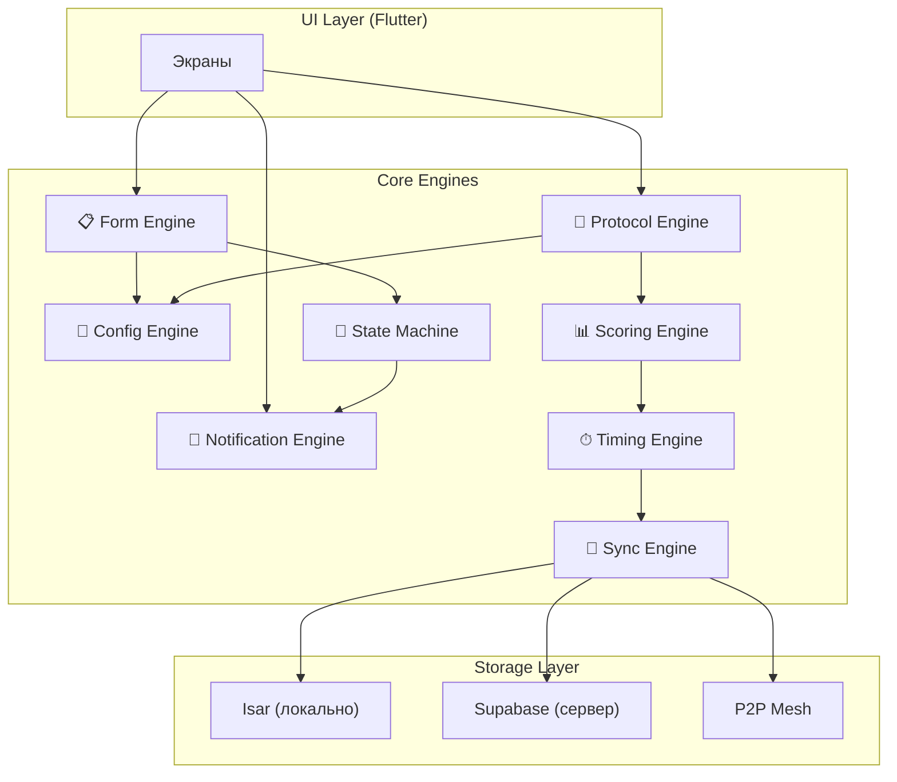
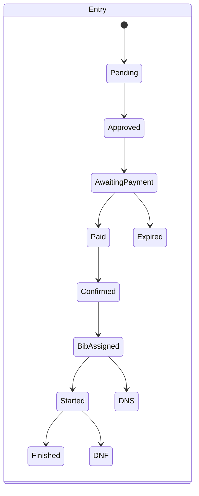

# 16. Engine Architecture — 8 движков SportOS

> 257 функций в 30 модулях сводятся к **8 переиспользуемым движкам**.
> Каждый модуль = комбинация движков с конфигурацией.

---

## Общая архитектура



---

## Engine 1: 🔧 Config Engine

> Единый движок настроек с трёхуровневым наследованием.

### Принцип
```
SportType (дефолт) → Event (override) → Discipline (override)
```

Организатор видит **только отличия** от дефолта. Изменённые поля помечены.

### Покрывает (~60 функций)
- Интервалы старта, cutoff, tie-break
- BIB формат и диапазоны
- Категории (авто по возрасту, ручные)
- Ценообразование (единая / per-дисциплина / combo)
- Политика возврата (ступенчатая)
- Min/max участников, команд
- Шаблон протокола (колонки)
- Юридические тексты (waiver, согласие)
- Все 20+ настроек из GAP-19

### Интерфейс

```dart
// Псевдокод
class ConfigEngine {
  /// Получить значение с учётом наследования
  T getValue<T>(String key, {String? disciplineId, String? eventId});
  
  /// Показать только overridden настройки
  Map<String, dynamic> getOverrides(String entityId);
  
  /// Применить шаблон вида спорта
  void applyTemplate(String sportTypeId, String eventId);
}
```

### Модель данных

```
EventSettings:
  id, entityType (sport|event|discipline), entityId, key, value, inheritedFrom
```

---

## Engine 2: 📋 Form Engine

> Конструктор форм с валидацией, условной логикой и хранением ответов.

### Принцип

Организатор собирает форму из блоков. Атлет заполняет. Данные сохраняются.

### Покрывает (~25 функций)

| Форма | Поля |
|---|---|
| Регистрация атлета | Имя, дата, пол, собака, дисциплина |
| Кастомные поля | Футболка, парковка, аллергии |
| Waiver/Согласие | Галочки + текст организатора |
| Регистрация волонтёра | Имя, позиция, доступное время |
| Ветконтроль | Собака ок ?, снаряжение ок ?, заметки |
| Мандатная комиссия | Документы ок ? |
| Протест | BIB заявителя, BIB обвиняемого, причина |
| Дозаявка на месте | Поиск + автозаполнение или гостевой профиль |

### Типы полей

```
text, number, date, dropdown, checkbox, radio, 
photo (загрузка), dog_selector, user_selector, bib_selector
```

### Условная логика

```
Если пол = "М" → показать категории мужские
Если возраст < 18 → показать блок "Подпись родителя"
Если дисциплина = "Скиджоринг" → показать поле "Выбор собаки"
```

---

## Engine 3: ⏱ Timing Engine

> Фиксация времени с точностью до 1/100с, привязка к атлету, расчёт.

### Принцип

```
Событие (тап/чип/камера) → TimeMark → привязка к Entry → расчёт NetTime
```

### Покрывает (~30 функций)

- Старт: individual, mass, wave, pursuit, relay
- Финиш: тап → отсечка → назначение BIB
- Чекпоинт: маршал отмечает прохождение
- Эстафета: передача этапа = финиш участника A + старт участника B
- Коррекция: ручное редактирование + audit log
- Cutoff: автоматический DNF при истечении
- ActualStartTime vs PlannedStartTime
- Photo-Finish интеграция

### Модель

```
TimeMark:
  id, entryId, checkpointId?, rawTime, correctedTime?,
  type (start|finish|checkpoint|relay_handoff),
  source (manual|chip|camera),
  deviceId, createdBy
```

### Расчёт

```
GrossTime = FinishMark.time - StartOfDiscipline
NetTime   = FinishMark.time - ActualStartTime
Result    = NetTime + sum(Penalties)
```

---

## Engine 4: 📊 Scoring Engine

> Универсальный расчёт позиций и рейтингов.

### Принцип

```
Входные данные → Правила (из ConfigEngine) → Позиции / Очки
```

### 5 режимов

| Режим | Вход | Выход |
|---|---|---|
| **Individual** | NetTime + penalties | Позиция в дисциплине |
| **MultiDay** | Day1.result + Day2.result | Суммарная позиция |
| **TeamScoring** | Позиции участников → очки | Командный рейтинг |
| **Series** | Per-event очки → сумма | Сезонный рейтинг |
| **PersonalBest** | Все результаты атлета | Лучшее время per-дисциплина |

### Конфигурируемые правила

```yaml
scoring:
  tieBreak: shared | start_order
  dnfPolicy: strict | penalized | open
  teamScoring:
    template: direct | penalty | degressive | coefficient | custom
    minMembers: 2
    maxMembers: 7
    countBest: 5
  series:
    dropWorst: 1
  outOfCompetition: true  # ВК не влияет на позиции
```

---

## Engine 5: 📄 Protocol / Export Engine

> Генерация документов из данных + шаблон.

### Принцип

```
Данные (Scoring Engine) + Шаблон (Config Engine) → PDF / CSV / PNG
```

### Покрывает (~20 функций)

| Документ | Данные | Формат |
|---|---|---|
| Финишный протокол | Results + настройка колонок | PDF / CSV |
| Командный протокол | TeamScoring results | PDF |
| Серийный протокол | Series standings | PDF |
| Стартовый лист | StartList entries | PDF |
| Сертификат/диплом | Имя, место, время, логотип | PDF |
| Карточка шаринга | Имя, место, время | PNG |
| Отчёт спонсору | Аналитика | PDF / CSV |

### Конструктор колонок (протокол)

```
Организатор выбирает: 
[✅ Место] [✅ BIB] [✅ Имя] [✅ Собака] [✅ Клуб] 
[✅ Time Day1] [✅ Time Day2] [✅ Total] [✅ Avg Speed]
[☐ Разряд] [☐ Тренер] [☐ Очки]
```

### Конструктор диплома

```
Организатор:
1. Загружает фон (изображение)
2. Размещает поля: {name}, {place}, {time}, {event}, {date}
3. Добавляет логотип
4. Preview → сохранить шаблон
```

---

## Engine 6: 🔔 Notification Engine

> Событие → адресат → канал → доставка.

### Принцип

```
Trigger (событие) → Recipients (кому) → Channels (push / email / inbox) → Deliver
```

### Покрывает (~20 функций)

| Trigger | Адресат | Каналы |
|---|---|---|
| Заявка подана | Организатор | inbox |
| Оплата подтверждена | Атлет | push + email + inbox |
| Таймаут оплаты | Атлет | push + email |
| Место в waitlist | Атлет | push + email |
| Результат утверждён | Атлет | push + inbox |
| Новый PB | Атлет | push |
| Протест подан | Судья | push + inbox |
| SOS | Все устройства | alert |
| Приглашение в роль | Пользователь | push + inbox |
| Диплом готов | Атлет | push + inbox |
| Волонтёр назначен | Волонтёр | push + inbox |

### Конфигурация

Организатор выбирает какие уведомления активны для мероприятия.

---

## Engine 7: 🔄 Sync Engine

> Данные между устройствами и сервером с приоритетами.

### Принцип

```
ДО ГОНКИ:     Supabase = истина
РЕЖИМ ГОНКИ:  P2P Mesh + Isar = истина (CRDT + LWW)
ПОСЛЕ ГОНКИ:  Выгрузка → Supabase
```

### Классификация данных

| Уровень | Данные | Конфликт |
|---|---|---|
| 🔴 Священные | TimeMark, штрафы, audit | Оффлайн ВСЕГДА |
| 🟠 Расовые | BIB, допуск, собака | Оффлайн в день гонки |
| 🟡 Организационные | Регистрация, оплата | LWW + уведомление |
| 🟢 Метаданные | Описание, логотип | LWW |

### Компоненты

```
SyncEngine:
  ├── P2PMesh (Nearby Connections / Multipeer)
  ├── CRDTResolver (LWW + priority rules)
  ├── TripleReplication (master + control + backup)
  ├── OfflineQueue (операции в очереди)
  └── ConflictNotifier (уведомления о конфликтах)
```

---

## Engine 8: 🔐 State Machine Engine

> Конфигурируемые статусы + переходы + проверки + побочные эффекты.

### Принцип

```
Entity(currentStatus) + Action → Guard(check) → NewStatus + SideEffects
```

### Машины состояний



### Guards (проверки перед переходом)

```
Confirmed → BibAssigned:
  guard: vetCheck.passed == true
  
Provisional → Official:
  guard: protests.open.count == 0

RaceMode → Completed:
  guard: allDisciplines.status == "finished"
  guard: allStartedAthletes.hasStatus == true
```

### Side Effects (побочные эффекты)

```
Entry → Paid:
  → NotificationEngine.send("Оплата подтверждена", entry.userId)

Entry → Finished:
  → ScoringEngine.recalculate(entry.disciplineId)
  → NotificationEngine.send("Финиш!", entry.userId)

Result → Official:
  → ProtocolEngine.generateCertificates(discipline)
```

---

## Модули как комбинации движков

| Модуль | Engines |
|---|---|
| Регистрация | Form + Config + StateMachine + Notification |
| Хронометраж | Timing + StateMachine + Sync |
| Результаты | Scoring + Protocol + Notification |
| Эстафета | Timing + Scoring + Form |
| Командный зачёт | Scoring + Config + Protocol |
| Серия/Кубок | Scoring + Config + Protocol |
| Протесты | Form + StateMachine + Scoring + Notification |
| Сертификаты | Protocol + Notification |
| GPS Tracking | Sync + Notification |
| Ветконтроль | Form + StateMachine |
| Многодневные | Scoring + Config + Timing |

---

## Порядок разработки

```
1. Config Engine      ← фундамент, всё зависит от него
2. State Machine      ← логика переходов
3. Sync Engine        ← offline-first, самый сложный
4. Timing Engine      ← core бизнес-логика
5. Form Engine        ← ввод данных
6. Scoring Engine     ← расчёт результатов
7. Notification       ← оповещения
8. Protocol/Export    ← генерация документов
```

> **Принцип**: каждый следующий движок зависит от предыдущих.
> Config первый потому что все остальные читают настройки оттуда.
