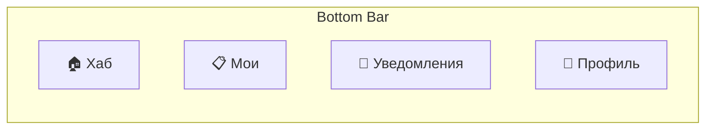
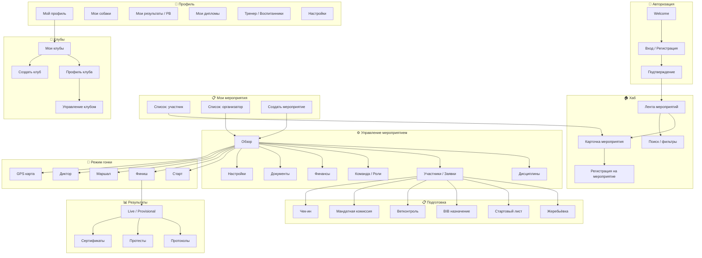

# 17. Screen Map — Полная карта экранов SportOS

> Все экраны приложения, навигация, роли. ~60 экранов.

---

## Навигация верхнего уровня



| Tab | Что видит | Описание |
|---|---|---|
| 🏠 Хаб | Все | Предстоящие мероприятия, поиск |
| 📋 Мои | Все | Мои мероприятия (как участник + как организатор) |
| 🔔 Уведомления | Все | Inbox уведомлений |
| 👤 Профиль | Все | Профиль, собаки, PB, дипломы, настройки |

---

## Карта экранов — полная



---

## Подробно по каждому экрану

### 🔐 Авторизация

| # | Экран | Элементы |
|---|---|---|
| A1 | **Welcome** | Логотип, «Войти», «Зарегистрироваться» |
| A2 | **Вход** | Email/телефон, пароль, OAuth (Google, Apple) |
| A3 | **Подтверждение** | OTP-код, верификация |

---

### 🏠 Хаб

| # | Экран | Элементы |
|---|---|---|
| H1 | **Лента мероприятий** | Карточки предстоящих; если нет — прошедшие с результатами; кнопка «Создать» |
| H2 | **Поиск** | Фильтры: город, дата, вид спорта, дистанция |
| H3 | **Карточка мероприятия** | Название, дата, место, дисциплины, кол-во участников, статус, кнопка «Зарегистрироваться» |
| H4 | **Регистрация** | Form Engine: выбор дисциплин, собака, waiver, оплата |

```
Карточка мероприятия (H3):
┌─────────────────────────────────────┐
│ 🏔 Чемпионат Урала 2026             │
│ 📅 15-16 марта  │  📍 Екатеринбург  │
│─────────────────────────────────────│
│ 🏁 Дисциплины:                      │
│  • Скиджоринг 5км  (32/40 мест)    │
│  • Нарта 10км      (18/30 мест)    │
│─────────────────────────────────────│
│ 📝 Описание мероприятия...          │
│─────────────────────────────────────│
│ ╔═══════════════════════════════╗   │
│ ║   📝 Зарегистрироваться       ║   │
│ ╚═══════════════════════════════╝   │
│ [📊 Стартовый лист] [📋 Результаты]│
└─────────────────────────────────────┘
```

---

### 📋 Мои мероприятия

| # | Экран | Элементы |
|---|---|---|
| M1 | **Как участник** | Список: предстоящие (статус заявки), прошедшие (результат) |
| M2 | **Как организатор** | Список: черновики, активные, завершённые |
| M3 | **Создать мероприятие** | Wizard: название → дата → место → вид спорта → дисциплины |

---

### ⚙️ Управление мероприятием (организатор)

```
┌─────────────────────────────────────┐
│ ⚙️ Чемпионат Урала 2026             │
│ [Обзор][Дисципл.][Участ.][Команда] │
│ [Финансы][Документы][Настройки]     │
├─────────────────────────────────────┤
│           Контент вкладки           │
├─────────────────────────────────────┤
│ ╔═══════════════════════════════╗   │
│ ║ 🏁 Перейти в режим гонки      ║   │
│ ╚═══════════════════════════════╝   │
└─────────────────────────────────────┘
```

| # | Вкладка | Содержимое |
|---|---|---|
| E1 | **Обзор** | Dashboard: участники, оплата, статус, быстрые действия |
| E2 | **Дисциплины** | Список дисциплин → настройка each (интервал, cutoff, категории) |
| E3 | **Участники** | Таблица заявок, фильтры, статусы, действия (подтвердить/отклонить) |
| E4 | **Команда** | Роли: судьи, стартёры, маршалы, вет. Назначение, приглашение |
| E5 | **Финансы** | Собрано / ожидается / возвраты. Промокоды. Отчёт |
| E6 | **Документы** | Waiver тексты, загрузка ПД-документов, шаблон диплома |
| E7 | **Настройки** | Config Engine: все настройки с наследованием |

---

### 📋 Подготовка к гонке

| # | Экран | Кто видит | Элементы |
|---|---|---|---|
| P1 | **Жеребьёвка** | Организатор | Режим (авто/ручной), drag'n'drop, утверждение |
| P2 | **Стартовый лист** | Все | Per-дисциплина, BIB + имя + время, PDF экспорт |
| P3 | **BIB назначение** | Организатор | Пул номеров, авто/ручное, alphanumeric |
| P4 | **Ветконтроль** | Ветеринар | Список собак, вакцинации, допуск ✅/❌ |
| P5 | **Мандатная комиссия** | Судья | Документы ок, чек-лист |
| P6 | **Чек-ин** | Судья | Отметка прихода, статистика |

---

### 🏁 Режим гонки (Ops-экраны)

> Wakelock ON, крупные кнопки, работа в перчатках.

| # | Экран | Кто | Описание |
|---|---|---|---|
| R1 | **Старт** | Стартёр | Очередь, обратный отсчёт, «Ушёл» / «DNS» |
| R2 | **Финиш** | Судья | ОТСЕЧКА → назначение BIB, список финишировавших |
| R3 | **Маршал** | Маршал | Плитки BIB, отметка прохождения, SOS |
| R4 | **Диктор** | Диктор | ТОП, подсказки, карточка атлета |
| R5 | **GPS карта** | Все | Карта + точки атлетов (если GPS включён) |

```
Навигация в режиме гонки:
┌─────────────────────────────────────┐
│ 🏁 РЕЖИМ ГОНКИ — Sprint 5km        │
│ ⏱ 01:23:45  │  📶 Mesh OK  │ 🔋87% │
├─────────────────────────────────────┤
│  [Старт] [Финиш] [Маршал] [Диктор] │
│   ← горизонтальные табы ролей →     │
├─────────────────────────────────────┤
│              Контент                │
└─────────────────────────────────────┘
```

---

### 📊 Результаты

| # | Экран | Кто | Элементы |
|---|---|---|---|
| RS1 | **Live результаты** | Все | Обновляется в реалтайме, позиции, время, дисциплина |
| RS2 | **Протоколы** | Все | Финишный протокол, командный, серийный. Фильтры по категории. PDF |
| RS3 | **Протесты** | Судья | Список протестов, статус, вердикт, закрытие |
| RS4 | **Сертификаты** | Организатор | Генерация, предпросмотр, выдача |

```
Экран результатов (RS1):
┌─────────────────────────────────────┐
│ 📊 Результаты │ 🔴 Live             │
├─────────────────────────────────────┤
│ Chips: [Скидж.] [Нарта] [Все]       │
│ Кат.:  [Муж.]  [Жен.]  [Все]       │
├─────────────────────────────────────┤
│ # │ BIB │ Имя      │ Время  │ Δ    │
│ 1 │ 07  │ Петров   │ 38:12  │ —    │
│ 2 │ 24  │ Иванов   │ 39:45  │+1:33 │
│ 3 │ 31  │ Козлов   │ 41:02  │+2:50 │
│ ВК│ 99  │ Сидоров  │ 37:55  │ вне к│
├─────────────────────────────────────┤
│ [📤 PDF]  [📤 CSV]  [📤 Поделиться]│
└─────────────────────────────────────┘
```

---

### 👤 Профиль

| # | Экран | Элементы |
|---|---|---|
| PR1 | **Мой профиль** | Фото, имя, город, вид спорта, разряд, квалификация |
| PR2 | **Мои собаки** | Список собак, карточка (порода, чип, вакцинации, фото) |
| PR3 | **Мои результаты** | Все результаты per-мероприятие + Personal Best |
| PR4 | **Мои дипломы** | Список PDF, скачивание, шаринг |
| PR5 | **Тренер / Воспитанники** | Воспитанники (список, PB, собаки), результаты (сезон, медали), планы (мероприятия). Приглашение, отклонение, открепление |
| PR6 | **Настройки** | Язык, уведомления, Privacy, выход |

```
Профиль (PR1):
┌─────────────────────────────────────┐
│         [📷 Аватар]                 │
│       Петров Алексей                │
│    📍 Екатеринбург │ 🏅 КМС         │
├─────────────────────────────────────┤
│ 🐕 Собаки: 2                        │
│ 🏆 Результаты: 12 соревнований      │
│ 📈 Personal Best:                   │
│    Скиджоринг 5км: 00:22:15 🔥      │
│    Нарта 10км: 00:45:33             │
│ 📜 Дипломы: 8                       │
├─────────────────────────────────────┤
│ [🐕 Собаки] [🏆 Результаты]         │
│ [📜 Дипломы] [👨‍🏫 Тренер]           │
│ [⚙️ Настройки]                      │
└─────────────────────────────────────┘
```

---

### 📋 Регистрация (H4 — подробно)

```
Шаг 1: Выбор дисциплин
┌─────────────────────────────────────┐
│ Выберите дисциплины:                │
│ ☑️ Скиджоринг 5км — 2000₽          │
│ ☑️ Нарта 10км — 3000₽              │
│ ☐ Пулка 3км — 1500₽                │
│─────────────────────────────────────│
│ Итого: 5000₽                        │
│ Промокод: [________] [Применить]    │
│─────────────────────────────────────│
│ [Далее →]                           │
└─────────────────────────────────────┘

Шаг 2: Собака + данные
┌─────────────────────────────────────┐
│ Скиджоринг 5км — собака:           │
│ [Rex (чип 123456)          ▼]      │
│                                     │
│ Нарта 10км — собака:               │
│ [Luna (чип 789012)         ▼]      │
│                                     │
│ Кастомные поля:                     │
│ Размер футболки: [M ▼]             │
│ Нужна парковка:  ☑️                  │
│─────────────────────────────────────│
│ [← Назад]             [Далее →]    │
└─────────────────────────────────────┘

Шаг 3: Юридические документы
┌─────────────────────────────────────┐
│ ☑️ Согласие на обработку ПД [📄]    │
│ ☑️ Отказ от ответственности [📄]    │
│ ☑️ Согласие на фото/видео [📄]      │
│                                     │
│ ⚠️ Несовершеннолетний:              │
│ ☑️ Подписано родителем/опекуном     │
│─────────────────────────────────────│
│ [← Назад]             [Далее →]    │
└─────────────────────────────────────┘

Шаг 4: Оплата
┌─────────────────────────────────────┐
│ К оплате: 5000₽                     │
│ Промокод: CANICROSS2026 (-500₽)     │
│ Итого: 4500₽                        │
│                                     │
│ Способ оплаты:                      │
│ ○ Банковский перевод (реквизиты)   │
│ ○ Онлайн оплата (v2+)             │
│                                     │
│ ⏳ Резерв: 48ч до подтверждения     │
│─────────────────────────────────────│
│ [← Назад]         [Отправить ✅]   │
└─────────────────────────────────────┘
```

---

## Сводка экранов

| Раздел | Кол-во экранов | Роли |
|---|---|---|
| Авторизация | 3 | Все |
| Хаб | 4 | Все |
| Мои мероприятия | 3 | Все |
| Управление мероприятием | 7 | Организатор |
| Подготовка | 6 | Организатор, судья, вет |
| Режим гонки | 5 | Стартёр, судья, маршал, диктор |
| Результаты | 4 | Все (протесты — судья) |
| Профиль | 6 | Все |
---

### 🏢 Клубы

| # | Экран | Элементы |
|---|---|---|
| C1 | **Мои клубы** | Список клубов с ролью, взносы, ожидающие заявки, поиск, создание |
| C2 | **Профиль клуба** | Hero шапка, стат-карточки (участники, мероприятия, тренеры), виды спорта, контакты, события (вкл. закрытые), участники, кнопка «Подать заявку» |
| C3 | **Управление клубом** | 4 вкладки: Участники (роли, оплата, PopupMenu), Взносы (категории, история, отметить оплату), Заявки (принять/отклонить), Настройки (контакты, передача владения, удаление) |
| C4 | **Создать клуб** | Логотип, название, город, описание, виды спорта (FilterChip), контакты, тип взноса (SegmentedButton), суммы по категориям |

---

### 💰 Промокоды (E5 — подробно)

| Параметр | Описание |
|---|---|
| Тип | Процент скидки / фиксированная сумма |
| Мин. сумма | Промокод действует от определённой суммы регистрации |
| Лимит | Макс. использований |
| Срок | Дата начала — дата окончания |
| Комбинирование | Можно ли совмещать с другими промокодами |
| Клубные | Автоматическая скидка для членов клуба |

---

## Сводка экранов

| Раздел | Кол-во экранов | Роли |
|---|---|---|
| Авторизация | 3 | Все |
| Хаб | 4 | Все |
| Мои мероприятия | 3 | Все |
| Управление мероприятием | 7 | Организатор |
| Подготовка | 6 | Организатор, судья, вет |
| Режим гонки | 5 | Стартёр, судья, маршал, диктор |
| Результаты | 4 | Все (протесты — судья) |
| Профиль | 6 | Все |
| Клубы | 4 | Все (управление — владелец) |
| **Итого** | **~42 основных** | |

> + модальные окна, формы, конструкторы ≈ **~60 уникальных UI-единиц**
